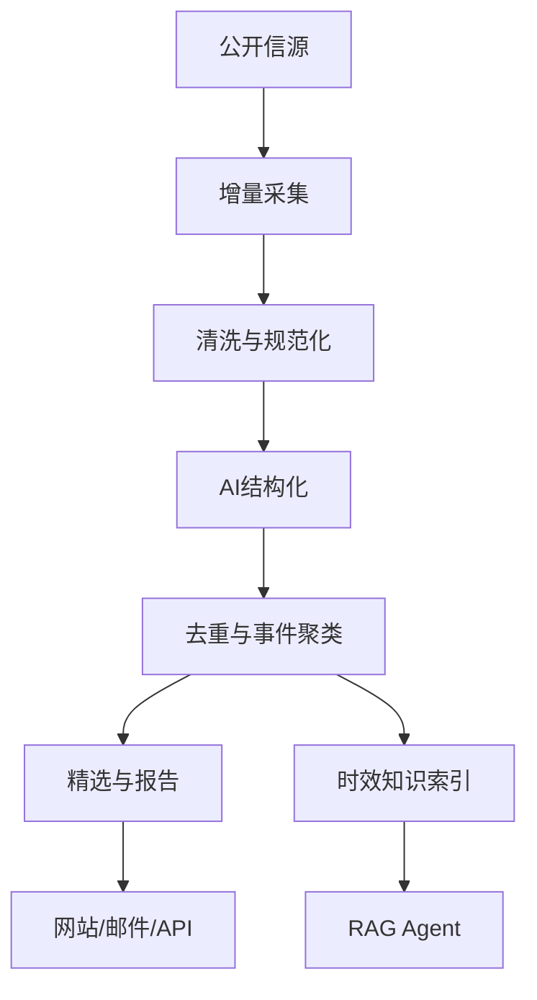

# 00｜AI Hot Radar 总规格与决策基线

文档 ID：`AHR-SPEC-000`  
版本：`1.1.0`  
状态：`APPROVED_FOR_BUILD`

## 1. 产品定义

AI Hot Radar 自动发现、核验和压缩 AI 行业信息，回答三个层级的问题：

1. **发生了什么**：精选、全部动态、热点、日/周/月报；
2. **如何演变**：公司、模型、技术主题的事件时间线；
3. **意味着什么**：基于原始证据的 RAG 问答、比较和影响分析。

产品核心不是“新闻页面 + 聊天框”，而是同一份可追溯情报数据同时驱动网站、邮件、报告、搜索、RAG 和开放 API。

## 2. 成功标准

| ID | 指标 | MVP 验收目标 |
|---|---|---|
| AHR-KPI-001 | P0 信源抓取成功率 | 24 小时滚动窗口 ≥ 98% |
| AHR-KPI-002 | 重复内容压缩率 | 已标注重复集的 pairwise F1 ≥ 0.90 |
| AHR-KPI-003 | 事件聚类质量 | 人工抽检纯度 ≥ 0.85 |
| AHR-KPI-004 | 发布时间准确率 | P0 来源抽检 ≥ 95% |
| AHR-KPI-005 | RAG 引用完整率 | 可验证事实句引用覆盖 ≥ 95% |
| AHR-KPI-006 | RAG 引用正确率 | 引用确实支持对应主张 ≥ 90% |
| AHR-KPI-007 | 新内容入站延迟 | P0 RSS p95 ≤ 20 分钟 |
| AHR-KPI-008 | 公共读接口 | 缓存命中时 p95 ≤ 300 ms |
| AHR-KPI-009 | RAG 首字延迟 | p95 ≤ 5 秒，完整回答 p95 ≤ 20 秒 |

## 3. 锁定技术决策

| ADR | 决策 | 理由 |
|---|---|---|
| ADR-001 | 前端使用 Next.js + TypeScript | 内容型产品、SSR/SEO 与组件生态 |
| ADR-002 | 核心业务后端使用 Java 21 + Spring Boot 3 | 承载内容查询、用户、订阅、权限和管理能力 |
| ADR-003 | AI/采集服务使用 Python + FastAPI | 正文抽取、NLP、Embedding、Rerank 与 Agent 生态 |
| ADR-004 | PostgreSQL 为唯一事实源，pgvector 同库起步 | 保持事务、过滤和向量检索一致；降低 MVP 运维复杂度 |
| ADR-005 | Redis 仅负责缓存、限流、短锁和短期状态 | 不作为事实数据库，不保存不可恢复业务状态 |
| ADR-006 | MVP 使用模块化单体 + 独立 AI Worker | 避免过早微服务化，同时保留 Java/Python真实跨语言边界 |
| ADR-007 | 采用数据库 Outbox 保证业务写入与任务发布一致 | 避免双写丢消息；RabbitMQ 在 M3 后按压测结果引入 |
| ADR-008 | RAG 采用时间/事件感知的多粒度混合检索 | 普通向量检索无法可靠回答“最近七天发生了什么” |
| ADR-009 | 引用绑定到 `evidence_passage`，最终跳转原文 | 回答可核验，不以 AI 摘要作为最终证据 |
| ADR-010 | Graph-lite 先用 PostgreSQL 关系表实现 | 需要实体—事件关系，但 MVP 不需要图数据库和完整 GraphRAG |
| ADR-011 | 信源发现与正文获取分离，公开默认仅展示节选和原文链接 | RSS 摘要不是 RAG 最终语料；读取全文能力不等于公开转载权 |

## 4. 版本范围

### M0–M2：可上线内容 MVP

必须完成：

- 完整导入 140 个可采集入口与 38 个受限社交监控目标；
- 以 `config/ingestion-profiles.yaml` 实现 9 类通用 Adapter，以 `config/site-overrides.yaml` 管理少量站点差异；
- RSS、列表和社交内容只负责发现；配置要求回源时必须取得 canonical 正文后才能通过全文门禁；
- Wave A 激活不少于 50 个 P0/P1 一手来源，MVP 连续运行验收不少于 30 个；
- RSS/Atom、官方更新日志、GitHub Release/API、仓库活动、arXiv/API、HTML/Sitemap 增量采集；
- 原始响应留存、URL 规范化、内容指纹和幂等；
- 正文抽取、翻译、摘要、分类、实体识别和质量评分；
- 精选、全部动态、详情、主题、日报、后台任务页；
- 基础事件聚类、主来源选择、邮件日报；
- Docker Compose 本地运行和单机云部署。

### M3–M4：RAG 与情报增强

必须完成：

- story/item/passage 三粒度索引；
- 时间、公司、模型、主题等结构化过滤；
- FTS/BM25 等价关键词召回 + pgvector 语义召回；
- RRF 融合、Reranker、事件去重、证据集选择；
- 流式回答、逐条引用、答案后校验和拒答；
- 比较、时间线、近期变化、事实核验四类查询；
- 离线 RAG 评测集和回归门禁。

### M5+：按数据与业务证据扩展

可以增加：RabbitMQ、OpenSearch、对象存储、MCP Server、API Key、个性化订阅、GraphRAG 或 RAPTOR。

## 5. 明确不做

| OUT ID | 当前不做 | 重新评估触发条件 |
|---|---|---|
| OUT-001 | 复制 AIHOT 品牌、代码、Logo 或原文文案 | 永不允许；只借鉴功能结构 |
| OUT-002 | 绕过登录、付费墙、robots 或平台限制采集 | 永不允许；使用授权适配器或仅保留链接 |
| OUT-003 | MVP 未授权 X/微信公众号抓取 | 获得稳定、合规、可持续的授权接口后；目标仍登记在 social-watchlist |
| OUT-004 | OCR/表格/复杂 PDF 全景解析 | 技术报告/论文成为核心语料且基础正文抽取无法满足时 |
| OUT-005 | 完整 GraphRAG 社区发现 | 多跳问题在评测中持续失败且关系边显著提升效果时 |
| OUT-006 | RAPTOR 全库递归摘要树 | 长文跨章节问题占比高且层级摘要实验收益显著时 |
| OUT-007 | Kubernetes | 单机/少量节点的容量和可靠性不足时 |

## 6. 总体业务流

## 7. 事实层级与内容政策

系统必须区分：

1. `raw_document`：采集到的原始响应，限内部审计；
2. `content_item`：单篇标准化内容；
3. `evidence_passage`：可定位的证据段；
4. `story`：多个来源共同描述的事件；
5. `report`：事件的编辑型汇总；
6. `rag_answer`：基于证据的临时生成结果。

网站和 RAG 不得把第 4–6 层生成内容伪装为原始事实。所有事实展示都必须保留 `source_id`、`canonical_url`、`published_at`、`fetched_at` 和来源等级。

## 8. 全局工程规则

- 所有数据库变更必须使用 Flyway；禁止手工改生产表。
- 所有外部请求必须有超时、指数退避、最大重试和可观测 request ID。
- 所有消费者必须幂等；幂等键优先使用 `source_id + external_id`，其次使用规范 URL 与内容指纹。
- LLM 输出必须通过 JSON Schema/Pydantic 校验；失败时最多修复一次，仍失败进入死信状态。
- Prompt、模型、Embedding 和 Reranker 必须记录版本。
- 时间统一存 UTC，API 返回 ISO 8601；UI 按用户时区展示。
- 删除/撤选内容必须通过 tombstone 进入增量 API，不能静默消失。
- 日报、搜索与 RAG 必须读取相同的已发布事实，不维护旁路“邮件专用数据”。

## 9. Definition of Done

一个任务只有同时满足以下条件才算完成：

- 代码、迁移和配置已提交；
- 单元测试和相关集成测试通过；
- API/Schema/行为变化已同步文档；
- 日志不包含密钥、完整 Prompt 私密输入或受限全文；
- 失败、空数据、超时、重试和幂等路径已验证；
- 对应需求 ID 能从测试或验收记录追溯；
- 没有用 mock 数据替代该里程碑要求的真实信源验收。
