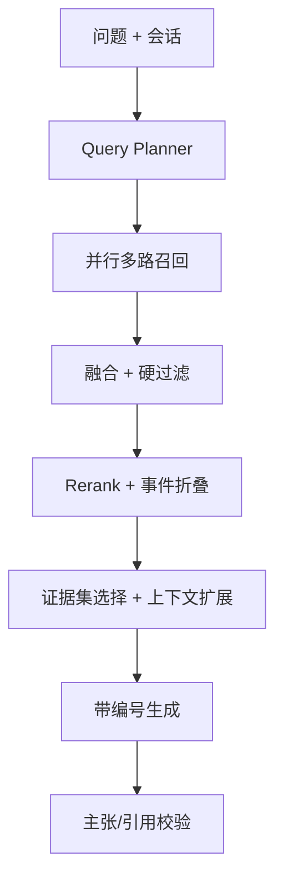

# 04｜时间与事件感知 RAG Agent

文档 ID：`AHR-RAG-400`

## 1. 设计结论

截图中的企业级 RAG 有可借鉴价值，但不能原样复制。AI Hot Radar 的语料主要是网页资讯、Release、官方文档更新和论文摘要，因此真正需要的复杂度是：

- **时间感知**：自然语言时间解析、事件时间与发布时间分离；
- **事件感知**：多篇报道先归并 Story，再回答；
- **来源感知**：一手来源优先、独立信源核验、观点与事实分离；
- **多粒度**：Story 找全局，Item 找报道，Passage 找可引用证据；
- **多路检索**：SQL/FTS/Vector/Story/Graph-lite 按题型组合；
- **可验证生成**：主张—证据绑定、引用反查、证据不足时拒答。

不把完整 GraphRAG、RAPTOR、OCR、表格通道列为 MVP 必选项。

## 2. 在线全流程



## 3. Query Plan：不可变执行契约

Planner 输出后冻结为 `RetrievalPlan`；后续节点只能记录降级，不能随意改变问题语义。

```json
{
  "query_type": "recent_updates|timeline|comparison|fact_check|explainer|recommendation",
  "normalized_question": "string",
  "subqueries": ["string"],
  "entities": [{"entity_id":"uuid|null","name":"OpenAI","type":"company","excluded":false}],
  "topics": ["agent"],
  "time_range": {
    "from":"2026-07-24T00:00:00Z",
    "to":"2026-07-31T23:59:59Z",
    "basis":"event_time|published_time|either",
    "timezone":"Asia/Shanghai",
    "explicit":true
  },
  "content_types": ["model_release","api_update"],
  "source_tiers": ["primary","authoritative_secondary"],
  "answer_format": "brief|detailed|timeline|comparison_table",
  "freshness_required": true,
  "needs_clarification": false,
  "clarification_question": null
}
```

默认时间语义：

- “最近/近期”未给跨度：7 天，并在回答开头明确；
- “本周/月”按用户时区；
- 无时间词的“发生了什么”：30 天；
- 历史解释型问题不强制时间窗；
- 时间范围过大且问题过宽时，先澄清或返回分阶段摘要。

## 4. 路由策略

| Query Type | 首要通道 | 辅助通道 | 特殊处理 |
|---|---|---|---|
| `recent_updates` | SQL 时间/实体 + Story | FTS、Vector | 按 Story 去重，优先最新与一手 |
| `timeline` | Story + relation | SQL、FTS | 按 event time 排序，保留纠正关系 |
| `comparison` | 分解为每个实体子问题 | Story、FTS、Vector | 对称时间窗与类别，避免一边证据更多 |
| `fact_check` | 精确关键词 + primary | Passage Vector | 至少一个直接证据，否则不确认 |
| `explainer` | Vector passage/item | FTS、Story | 父块扩展，允许较长背景 |
| `recommendation` | Story + 用户规则 | Vector | 事实和建议分段，建议不可伪装成来源事实 |

## 5. 多路召回

每个子问题最多并行启用五个通道：

1. `TEMPORAL_SQL`：实体、时间、类型、状态、来源层级过滤；
2. `KEYWORD_FTS`：标题、版本号、缩写、实体别名和正文关键词；
3. `VECTOR_PASSAGE`：证据语义；
4. `VECTOR_STORY_ITEM`：事件/文章的高层语义；
5. `GRAPH_LITE`：entity—story—story relation 邻接扩展。

默认每通道 topK：SQL 40、FTS 40、Passage 60、Story 30、Graph-lite 20；融合后最多 100，精排后 24，最终证据 6–12 条。实际参数必须用评测集调优，不能作为永恒常量。

## 6. 融合、门控与精排

先执行硬过滤：`status=PUBLISHED`、时间、排除实体、版权、语言和权限。再用 RRF 融合：

```text
rrf(d) = Σ_channel weight(channel) / (60 + rank_channel(d))
```

元数据只作为受控 boost，不与同一信号重复计分：

- primary source：`+0.08`；
- 时间窗内且含明确 event time：`+0.05`；
- 直接命中目标实体为主语：`+0.05`；
- 重复转载：`-0.10`；
- 观点内容用于事实问题：`-0.15`。

Reranker 输入：原始问题、子问题、候选标题、passage、实体、时间、来源等级；输出 `relevance`、`directness`、`temporal_fit`、`source_fit`。可以使用 cross-encoder 或稳定的 LLM 结构化打分，模型必须可配置和版本化。

## 7. 事件折叠与上下文扩展

- 同一 Story 最多保留 1 个主来源 passage + 2 个提供新增信息的独立来源；
- 父块提升：passage 命中后补充标题、摘要、heading path；
- 兄弟扩展：仅补前后各一块，且总 token 不超过预算；
- Story 扩展：加入事件摘要仅用于组织答案，事实仍绑定原始 passage；
- 比较问题为各实体保留相近证据预算，避免证据不对称。

## 8. 最终证据选择

证据选择目标不是“分最高的前 N 条”，而是在 token 预算内覆盖所有子问题和关键主张：

```text
maximize: query_coverage + source_diversity + claim_directness
          + primary_source_ratio - redundancy
subject to: token_budget, time_range, citation_eligibility
```

最低证据规则：

- recent updates：至少 1 个 Story，关键事件各至少 1 个 passage；
- comparison：每个比较对象至少 2 个可比事件，否则标注不对称；
- fact check：至少 1 个直接一手证据，或 2 个独立权威二手证据；
- timeline：每个时间节点必须有来源。

## 9. 生成和引用绑定

生成输入中的每条证据有稳定编号 `[E1]...[En]`，包含 passage ID、来源、日期、定位和文本。模型输出结构：

```json
{
  "answer_markdown": "... [E1]",
  "claims": [
    {"text":"string","evidence_ids":["E1"],"certainty":"confirmed|likely|uncertain"}
  ],
  "limitations": ["string"]
}
```

服务端解析 `[E1]` 并绑定真实 `evidence_passage.id`，前端不信任模型生成的 URL。显示格式为 `[1]`，点击打开来源卡片和原文定位。

## 10. 生成后校验

必须执行三层校验：

1. **格式**：引用编号存在、无孤立 URL、时间格式正确；
2. **覆盖**：每个可验证事实主张至少一个引用；
3. **支持度**：NLI/cross-encoder 或受控 LLM 判断 evidence 是否蕴含 claim。

失败策略：

- 少量未支持句：删除或改写并再校验一次；
- 核心结论无证据：返回部分答案 + 明确缺口；
- 时间/实体解析置信度低：请求澄清；
- 检索为空：说明检索时间和范围，不让模型凭常识补答。

## 11. 会话记忆

只保存：长期用户偏好摘要、最近 6–10 轮压缩 transcript、已解析实体/时间和用户明确收藏。检索事实每轮重新获取；不得把旧回答当成新事实。追问“它呢？”时可继承实体，但新的时间表达覆盖旧时间窗。

## 12. 分阶段实现

| 阶段 | 必做 | 暂不做 |
|---|---|---|
| RAG-MVP | Planner、SQL+FTS+Vector、RRF、Rerank、Story 折叠、引用、拒答 | Graph-lite、多跳 |
| RAG-V1 | 比较分解、Graph-lite、一手来源门控、答案校验、评测回归 | 图社区摘要 |
| RAG-V2 | 事件演化、多跳关系、个性化建议 | 仅在收益明确时试验 RAPTOR/GraphRAG |

## 13. 何时引入截图中的高级能力

| 能力 | 当前判断 | 触发条件 |
|---|---|---|
| Parent/Child | 采用简化版：Item/Passage + 上下文扩展 | 已纳入 MVP |
| HyDE | 默认关闭 | 语义解释型问题 Recall@20 明显不足且实验提升 ≥ 5% |
| GraphRAG | 先 Graph-lite | 多跳/关系题占比高，图实验显著提升且成本可控 |
| RAPTOR | 不采用 | 长文跨章节总结成为主要问题 |
| TABLE | 不采用独立通道 | 财报/榜单等表格成为核心语料 |
| OCR | 不采用 | 扫描 PDF/图片资讯成为稳定来源 |
| 多子问题并行 | 比较/时间线采用，简单问题不拆 | 已纳入 RAG-V1 |

## 14. RAG 评测

黄金集按六类各不少于 15 题：近期变化、时间线、比较、事实核验、解释、空答案/诱导问题。指标：

- Planner entity/time/type accuracy；
- Retrieval Recall@10/20、MRR、Story coverage；
- nDCG@10 与 primary-source@5；
- citation completeness/correctness；
- groundedness、answer relevance、abstention accuracy；
- p50/p95 延迟、token 与模型成本。

任何 Prompt、Embedding、Reranker、分块或融合权重变化都必须跑回归评测，并记录 `eval_run_id`。

