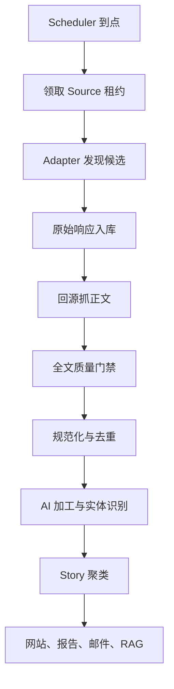

# 11｜端到端运行与联调手册

文档 ID：`AHR-RUNBOOK-1100`

## 1. 每次轮询发生什么



1. Java Scheduler 查询 `next_poll_at <= now()` 的 ACTIVE 来源；
2. 以 `source_id` 获取有期限租约，避免多实例重复轮询；
3. 创建 `crawl_run` 和 `ingestion_task`；
4. Worker 加载 `sources.yaml + ingestion-profiles.yaml + site-overrides.yaml`；
5. Adapter 读取 Feed/API/列表，输出候选；
6. 原始响应先写 `raw_document`，然后解析；
7. 需要回源的候选创建 Fetch 子任务；
8. 正文门禁通过后写 `content_item/content_revision/content_chunk`；
9. outbox 驱动 enrichment、embedding 和 story clustering；
10. 首页、邮件、RAG 只读取 READY/PUBLISHED 数据。

## 2. 状态推进

```text
DISCOVERED → FETCHED → PARSED → NORMALIZED → ENRICHED → READY
                  ↘ FETCH_FAILED / ACCESS_RESTRICTED
                            ↘ PARSE_FAILED / FULLTEXT_REJECTED
```

状态只能由带 `input_version` 的任务推进。晚到结果如果版本过期，记录 `STALE_RESULT`，不能覆盖新正文。

## 3. 本地启动顺序

```text
1. PostgreSQL + pgvector
2. Redis
3. Flyway migration
4. Spring Boot API/Scheduler
5. FastAPI Worker
6. Next.js Web
7. probe 指定的 3 个 fixture 来源
8. 开启 Wave A 的低频真实轮询
```

M1 不强制 RabbitMQ。任务表达到以下任一条件再写 ADR 引入：持续 backlog > 10,000、峰值任务延迟超 SLO、需要独立消费者扩缩容或数据库轮询开销不可接受。

## 4. 首次真实验收

按顺序启用：

1. 2 个 RSS：验证 Feed → 原文全文；
2. 2 个 GitHub Release：验证 JSON body、分页、ETag；
3. 2 个 Changelog：验证 section diff；
4. 1 个 arXiv 分类：验证 HTML/PDF；
5. 1 个静态列表：验证 URL 发现和 canonical；
6. 其余 Wave A 批量 probe。

真实验收绝不能在 CI 里高频打第三方站点。CI 使用脱敏 fixture；每日 canary 才运行少量线上探测。

## 5. 一条内容怎样服务四个出口

| 出口 | 使用的数据 | 约束 |
|---|---|---|
| 网站详情 | title、AI summary、excerpt、canonical | 默认不公开镜像全文 |
| 日报/邮件 | Story 摘要、主来源、推荐理由 | 同事件只出现一次 |
| RAG | 原始 evidence passage + 时间/实体元数据 | 每个事实绑定 passage |
| API/RSS 输出 | 结构化元数据、摘要、原文链接 | 支持增量 cursor |

邮件不是输入源，而是同一事实库的输出。

## 6. 日报批处理

```text
截止时间锁定候选 Story
→ 过滤证据不足/重复/过旧事件
→ 质量、影响、时效、开发者相关性打分
→ 类别配额与多样性重排
→ 生成结构化日报
→ 引用校验
→ 预览/自动发布
→ 用户订阅过滤
→ 邮件投递与结果记录
```

日报生成失败不阻塞资讯入库；模型不可用时可以用已生成 Story 摘要或延迟发布，不得生成无引用事实。

## 7. RAG 联调

问题“最近 7 天 OpenAI 有什么更新？”的联调证据应包括：

1. QueryPlan 中时区换算后的明确起止时间；
2. entity=OpenAI；
3. SQL/FTS/vector 各自召回数量；
4. RRF 与 reranker 分数；
5. Story 折叠后最终 evidence passage；
6. 回答每项事实的 citation_id；
7. citation_id 能解析到 `content_chunk → revision → canonical_url`；
8. 证据不足时明确说明限制。

## 8. 观测与告警

必须观测：

- `source_poll_total{source,status}`；
- `discovery_items_total`；
- `fulltext_gate_total{decision,reason}`；
- `fetch_duration_seconds`；
- `source_freshness_lag_seconds`；
- `task_backlog/task_oldest_age`；
- `story_cluster_size`；
- `rag_retrieval_latency/rag_citation_support_rate`；
- `email_delivery_total{provider_status}`。

高优先告警：P0 来源 6 小时无成功、全源新增量异常归零、正文成功率跌破 70%、任务最老年龄超过 30 分钟、RAG 引用支持率低于发布门禁、邮件硬退信激增。

## 9. 故障恢复

- Source 报错：隔离单源，不停止全局；
- Worker 宕机：租约过期后重领，任务幂等重放；
- LLM 不可用：保留 READY 前状态，稍后重试；网站继续读旧内容；
- 数据库恢复：先停调度，再恢复备份与 WAL，最后从 outbox/checkpoint 重放；
- Selector 失效：保存失败样本，更新 override 与 fixture 后解除隔离；
- 错误合并 Story：人工 split 并锁定，聚类器不得再次自动合并。

