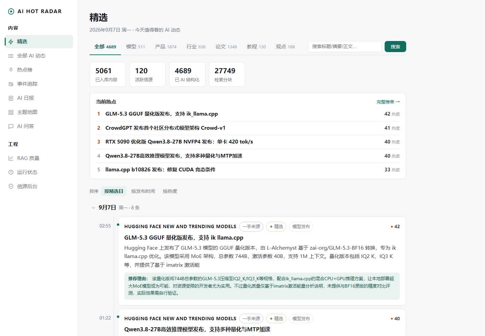
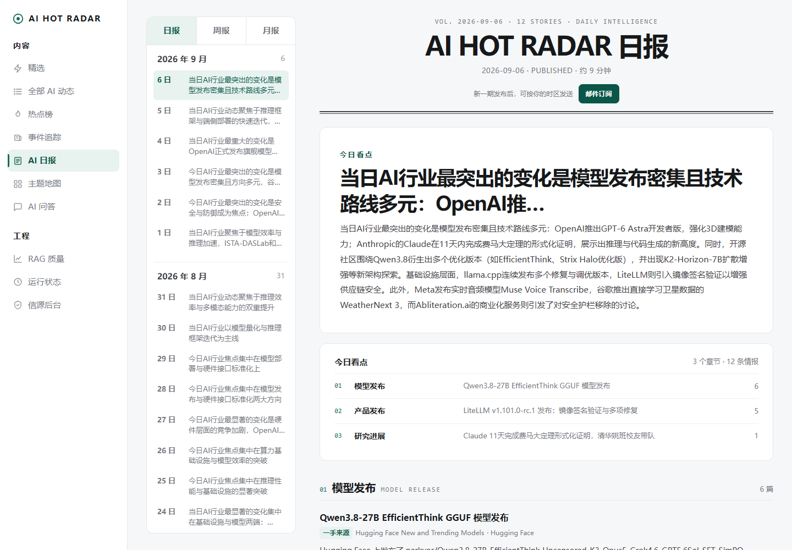
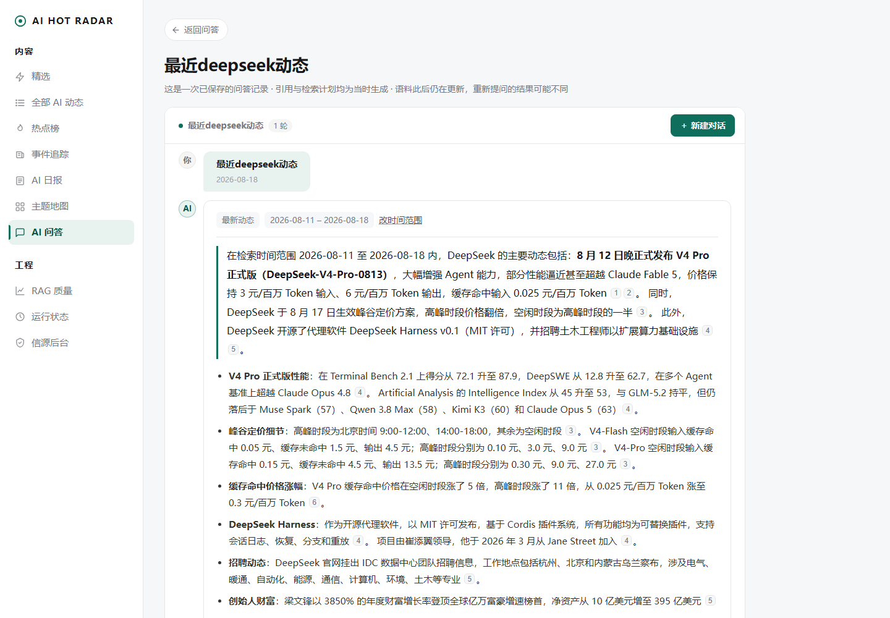
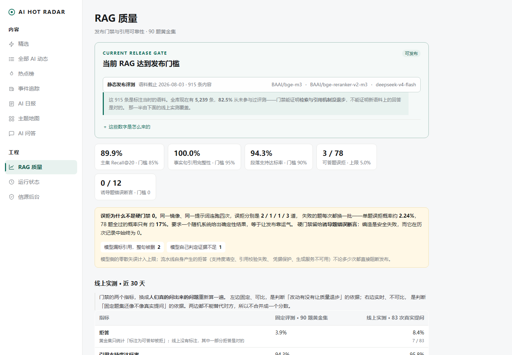
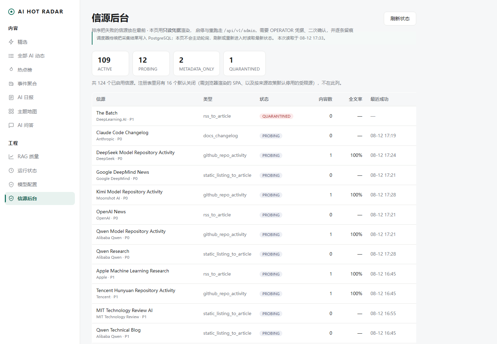
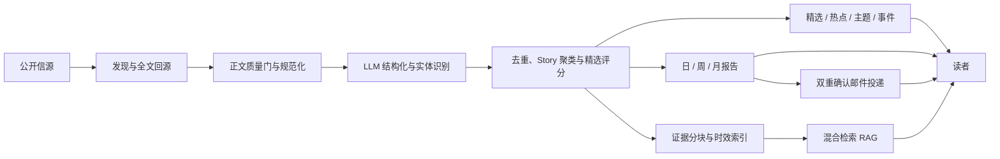
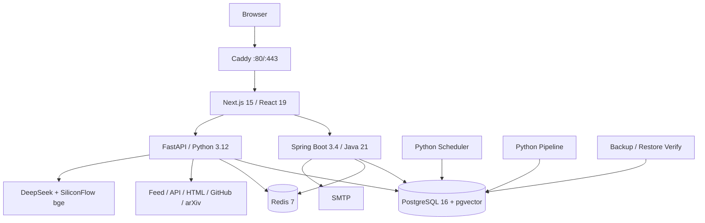
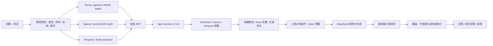

# AI Hot Radar

> 面向 AI 行业的可追溯时效情报平台：持续采集公开信源，把分散资讯整理为事件、精选与
> 日/周/月报告，并在同一份原文证据库上提供可解释、可评测、每句话可回跳原文的 RAG 问答。

- 在线体验：[https://aihotradar.online](https://aihotradar.online)
- 当前生产：`v0.1.7@c1c6918`，香港 2C4G 单机 Docker Compose，Caddy HTTPS
- 2026-08-12 生产快照：140 个登记信源、2040 条内容、8089 个分块（100% 向量化）、
  1622 个事件；数据持续增长，本行不是固定业务承诺
- 质量基线：Python 884 通过、2 跳过，Java 74、Web 73 个测试（2026-08-12 CI）；RAG 使用
  固定 90 题发布集与逐题证据



## 30 秒：这个项目解决什么问题

AI 行业信息分散在官方博客、文档更新、GitHub、论文站和行业媒体中。普通聚合站解决的是
“把链接放在一起”，AI Hot Radar 进一步解决四个问题：

1. **及时发现**：按信源节奏增量采集，同时记录成功、失败、全文率和新鲜度；
2. **压缩噪声**：区分重复文章与同一事件，把多篇报道组织成 Story；
3. **稳定交付**：同一事实库产出精选、热点、主题、日/周/月报和双确认邮件订阅；
4. **可核验问答**：RAG 只引用原始证据段，服务端绑定引用与 URL，证据不足就部分回答或拒答。

它不是“新闻页面 + 聊天框”的拼接，而是一条从公开来源到可追溯情报产品的完整数据链路。

## 3 分钟：产品、业务与技术全景

### 用户能做什么

| 用户任务 | 产品出口 | 关键约束 |
|---|---|---|
| 快速看今天值得关注的内容 | 精选、全部动态、热点榜 | 来源族配额、上海自然日、批次时间不伪装成精确分钟 |
| 理解一个事件如何发展 | Story、主题地图、时间线 | 区分事件时间、发布时间和抓取时间；一手来源优先 |
| 按周期消费信息 | 日报、周报、月报、邮件 | 只发送 `PUBLISHED` 快照；双重确认、幂等投递、即时退订 |
| 对站内语料追问 | 多轮 RAG、句级引用、原文回跳 | 每个事实句有服务端引用；检索为空时不靠模型常识补答 |
| 判断系统是否可靠 | RAG 质量、运行状态、模型与信源后台 | 固定发布评测与动态运行数据分开呈现 |

<details>
<summary>查看其余四张产品截图</summary>

**日报 / 周报 / 月报**



**带原文引用与检索解释的 RAG**



**固定黄金集上的 RAG 发布门禁**



**随调度结果变化的信源后台**



</details>

### 业务架构



所有出口读取同一份已发布事实。邮件不维护“邮件专用语料”，RAG 不把 AI 摘要当最终证据，
报告生成失败也不会阻塞资讯入库与网站读取。

### 技术架构与服务边界



| 层 | 技术 | 负责什么 | 明确不负责什么 |
|---|---|---|---|
| Web | Next.js 15.5、React 19、TypeScript、App Router、SSR | 内容页面、交互、同源代理、流式问答 UI | 直接查库、保存模型密钥或 OPERATOR 凭据 |
| Core API | Spring Boot 3.4、Java 21、Maven | 公共读 API、报告发布、订阅、管理 RBAC/审计 | 网页抽取、Embedding 与 RAG 算法 |
| AI Service | FastAPI、Python 3.12、Pydantic、httpx | 采集、抽取、结构化、聚类、报告生成、RAG、评测 | 用户权限和邮件订阅业务事实 |
| 数据库 | PostgreSQL 16、pgvector、Flyway V001–V024 | 唯一事实源、状态机、全文/向量索引、检索与投递记录 | 临时缓存语义 |
| 短状态 | Redis 7 | 读缓存、限流、RAG 缓存、短锁 | 任何不可恢复的业务真相 |
| 模型 | DeepSeek V4 Flash/Pro；bge-m3、bge-reranker-v2-m3 | 生成/结构化；Embedding 与交叉编码器重排 | 模型输出未经 schema/引用校验直接入库或发布 |
| 交付 | Docker Compose、Caddy、GHCR、GitHub Actions | 单机编排、HTTPS、不可变 SHA 镜像、CI/CD | 当前规模下没有证据需要的 Kubernetes/Kafka |

为什么拆成 Java 与 Python：稳定的内容、订阅、权限与投递边界放在 Core API；快速变化的采集、
NLP、向量和评测生态放在 AI Service。二者共享契约和 PostgreSQL 事实，但不互相侵入职责。

## 30 分钟：核心链路与工程深度

### 从一个链接到一条可引用证据

```text
sources.yaml + ingestion-profiles.yaml
  → Scheduler 领取到期信源租约
  → Adapter 从 RSS/API/列表发现候选
  → 回到 canonical 页面取得正文
  → SSRF、大小、超时、重试、主机限速与全文质量门
  → URL 规范化 + external id + content hash 幂等去重
  → content_item / content_revision 版本化
  → DeepSeek 按 Pydantic/JSON Schema 生成摘要、类型、实体和 claims
  → 按标题/语义边界切块，保留 heading 与字符定位
  → bge-m3 向量化 + PostgreSQL 全文索引
  → 近重复压缩、Story 事件聚类、精选评分、报告与 RAG
```

RSS 或搜索摘要只能用于**发现**。当来源要求全文回源时，canonical 正文没有通过全文门就不能
进入最终证据层。外部调用均有超时、有限重试、per-host 限速、幂等键与 trace id；LLM 输出
通过 schema 校验后才允许落库。

核心数据层级刻意分开：

| 实体 | 含义 | 为什么不能混 |
|---|---|---|
| `source` / `crawl_run` | 信源配置与一次运行事实 | 信源失败不应删除历史内容 |
| `content_item` / `content_revision` | 稳定内容身份与正文版本 | 同 URL 更新需要保留处理版本 |
| `content_chunk` | 可检索、可定位的原文证据段 | 引用最终绑定到这里，不绑定 AI 摘要 |
| `entity` / `topic` | 公司、模型、技术与主题 | 支持结构化过滤和主题页 |
| `story` / `story_item` | 多篇文章描述的同一事件 | “文章重复”不等于“事件相同” |
| `report` | 已保存的日/周/月发布快照 | 邮件只发送 `PUBLISHED`，不临时再生成 |
| `rag_query` / `rag_citation` | 问题、计划、轨迹、答案与引用 | 让一次回答可复现、可审计 |

### RAG 全链路



1. **Query Plan**：把“最近一周”解析为用户时区的绝对时间窗；识别近期、时间线、比较、
   事实核验、解释和不可答问题；受控别名与上一轮实体处理“它/那家公司”。
2. **Dense**：bge-m3 向量 + pgvector HNSW 处理自然语言改写与语义相似。
3. **Sparse**：PostgreSQL `tsvector`/GIN 与 CJK bigram 保留型号、版本号、缩写和精确词。
4. **时间/实体通道**：明确时间窗或目标实体时，在 SQL 层约束已发布候选。
5. **RRF**：不同召回分数量纲不一致，先按名次融合，再交给统一的交叉编码器重排。
6. **Rerank 与元数据**：评估 query-passage 相关性，再受控调整直达度、来源和时间适配。
7. **证据选择**：限制同篇占位、折叠同一事件、优先一手来源，在预算内覆盖问题子目标。
8. **父块展开**：命中 passage 后按问题类型补标题、相邻段或父级上下文，事实仍绑定原始 chunk。
9. **生成**：模型只看到 `[E1]…[En]` 编号证据，输出 Markdown/claims；通用 LLM 查询改写
   默认关闭，因为评测没有证明额外往返有收益。
10. **可信出口**：后端忽略模型 URL，把编号重新绑定数据库中的 chunk/canonical URL；删除弱支持
    和无引用事实句，编号越界、空正文非拒答、零引用非拒答等不变量失败时 fail closed。
11. **可观测性与缓存**：每次问答保存 dense/sparse 名次、融合/重排、元数据调整、淘汰原因、
    模型版本、耗时与引用；缓存键包含语料新鲜度，重复提问命中时不会复用过期知识。

真实案例中，目标证据在 dense 第 14、sparse 第 1、融合后第 3。这是混合检索的直接价值；
但 B8 在接入 reranker 后扫描 42 组权重只剩 0.0004 差距，因此没有为了漂亮中间分数改生产权重。

### RAG 如何评测

`/eval` 是**固定发布快照**，不是随每次线上提问变化的实时大盘。黄金集有 90 题，近期变化、
时间线、比较、事实核验、原理解释、不可答/诱导六类各 15 题；模型、切块、Embedding、
Reranker、Prompt 或检索策略变化后必须生成新 `eval_run_id`，旧轮次不可覆盖。动态请求的
延迟、token、错误和估算成本在 `/ops`。

| 门禁/诊断 | 当前发布快照 | 解释 |
|---|---:|---|
| 主集 Recall@20 | **0.8994** | 相关证据进入前 20 的比例，门槛 0.85 |
| 中文厂商专项 Recall@20 | **0.9333** | 15 题；加入 8 个真实近邻噪声后不退化 |
| 句级引用覆盖率 | **0.9881** | 需要证据的事实句是否有服务端引用 |
| 段落支持度达标率 | **0.9344** | 引用 passage 是否支持对应陈述，门槛 0.90 |
| 可答题误拒 | **0 / 78** | 明明有证据却拒答的题数 |
| 诱导题错误断言 | **0 / 12** | 没有证据时是否顺着假前提编造 |
| 重复提问延迟 | **14171ms → 211ms** | freshness-aware 缓存实测，不代表首次请求延迟 |

自动支持度不能替代高风险数字的人审；指标必须连同 run、语料截止时间、模型和样本量一起引用。

### 三个最有价值的工程案例

| 案例 | 现象 | 结论 |
|---|---|---|
| B2 混合检索退化 | 直接把 dense/sparse 并集反而比纯 dense 差 | 混合检索必须有融合与重排，不能只增加通道 |
| B8 权重扫描 | 42 组 RRF 权重在 reranker 后差距仅 0.0004 | 不改生产权重，保留负结果，停止无收益调参 |
| GEN-FIX 误拒 | 误拒升到 7.69%，原先怀疑语料增长造成竞争 | 抓原始响应发现答案正确但 JSON/claims 偏离；修解析失败出口后回到 0%，原假设被证伪 |

这些记录的价值不在“指标更高”，而在于每个组件是否上线都能被数据支持或否决。

### 报告与邮件闭环

```text
候选 Story 锁定 → 去重/证据/类别门 → 结构化报告 → 引用校验 → PUBLISHED
用户输入邮箱与周期 → 24 小时确认请求 → 点击确认 → ACTIVE
收件人时区 08:30 到期 → 领取 PUBLISHED 报告 → 幂等 SMTP 投递 → SENT/重试/失败记录
```

邮件发送的是已保存报告的标题、摘要、章节和回站链接，不重新调用模型生成另一份内容。
`(subscription_id, report_id)` 唯一事实和数据库锁防重复发送；失败最多有限重试，且不反向阻塞
采集、精选、AI 动态或站内报告。

### 生产交付、安全与恢复

- PR/CI 合入 `main` 后，Release workflow 才构建带 Git commit SHA 的三张 GHCR 镜像；
- 服务器只部署不可变 `sha-<40 hex>`，不在生产机器修改源码或临时 build；
- Caddy 是唯一公网入口，Core API、AI Service、PostgreSQL、Redis 只在 Compose 网络内；
- 管理端有 VIEWER/OPERATOR、二次确认、幂等键和审计；密钥只进入权限 600 的生产 `.env`；
- 每日 PostgreSQL 备份带 SHA-256，已有异机副本与隔离恢复证据；Redis 丢失不影响业务事实；
- 当前模型推理在供应商侧，2C4G 的主要风险是内存、磁盘、日志和外部 API 长尾，而不是本地 GPU。

**刻意不引入** Kafka/RabbitMQ、Elasticsearch/OpenSearch、独立向量库、Kubernetes、GraphRAG
或 RAPTOR。当前数据量、并发和单机交付不证明它们的收益；触发条件和回滚方案在 `docs/adr/`。

## 本地运行

Docker Compose 是唯一支持的启动方式：

```bash
cp .env.example .env
docker compose -f infra/compose/docker-compose.yml up -d --build
```

填入独立的 DeepSeek 与 SiliconFlow 测试密钥。不要提交或打印 `.env`。默认入口：Web
`http://localhost:3000`、Core API `:8080`、AI Service `:8000`；Flyway 随 Core API 启动迁移。

主要页面：`/`、`/items`、`/hot`、`/stories`、`/topics`、`/reports`、`/ask`、`/eval`、
`/ops`、`/admin/models`、`/admin/sources`。

## 验证

```bash
cd apps/ai-service
python -m pytest -q
python -m mypy src
python -m ruff check .
```

```bash
cd apps/web
npm run typecheck
npm run lint
npm test
npm run build
```

Java 需要 JDK 21；也可使用 Maven JDK 21 容器运行 `mvn -B verify`。完整 CI 还包含契约生成
diff、Flyway 空库/升级、依赖审计、秘密扫描、Compose smoke 与受影响的 RAG 门禁。

## 当前边界与下一步

- 自动 citation precision 是诊断指标，不能替代高风险数字和主体关系的人审；
- 一个 SLA 类专项问题的目标原文稳定排第 27，当前安全拒答，尚未靠扩大在线成本强行解决；
- 信源后台是数据库快照，不是实时告警控制台；管理写操作已有 API/RBAC/审计但没有浏览器 UI；
- `outbox_event` 当前只写不读，一致性依靠数据库轮询；没有把预留表包装成已完成的消息架构；
- 个人 Gmail 适合上线验证，不适合长期产品投递，后续需自有域名发件与 SPF/DKIM/DMARC；
- 进入私有知识库或多租户之前，不提前引入账号、ACL 和租户隔离。

当前任务与生产交接以 [`docs/status/handoff-20260812.md`](docs/status/handoff-20260812.md)
为准，不从 README 的历史数字推断实时状态。

## 文档导航

| 想了解什么 | 从这里开始 |
|---|---|
| 从业务到代码完整吃透项目 | [`docs/handbook/README.md`](docs/handbook/README.md) |
| 面试复习全套材料 | [`docs/interview/README.md`](docs/interview/README.md) |
| 按业务链路阅读全部代码 | [`docs/code-map.md`](docs/code-map.md) |
| 30 秒 / 3 分钟 / 10 分钟介绍 | [`00-project-one-pager.md`](docs/interview/00-project-one-pager.md) |
| 业务与系统架构 | [`01-business-and-architecture.md`](docs/interview/01-business-and-architecture.md) |
| 采集、全文门与数据模型 | [`02-ingestion-and-data-model.md`](docs/interview/02-ingestion-and-data-model.md) |
| RAG 全链路、指标和失败实验 | [`03-rag-deep-dive.md`](docs/interview/03-rag-deep-dive.md) |
| 后端、一致性、前端与运维 | [`04`](docs/interview/04-backend-and-consistency.md) · [`05`](docs/interview/05-frontend-product.md) · [`06`](docs/interview/06-deployment-security-ops.md) |
| 120 题、10 个 STAR、白板与演示 | [`07`](docs/interview/07-interview-question-bank.md) · [`08`](docs/interview/08-resume-and-star-stories.md) · [`09`](docs/interview/09-system-design-whiteboard.md) · [`10`](docs/interview/10-demo-script.md) |
| 锁定规格与架构决策 | [`docs/spec/00-master-spec.md`](docs/spec/00-master-spec.md) · [`docs/adr/`](docs/adr/) |
| 完整实现状态与逐轮证据 | [`docs/spec/12-delivery-index.md`](docs/spec/12-delivery-index.md) · [`docs/status/project-status.md`](docs/status/project-status.md) |
| 当前/历史状态与验收证据分类 | [`docs/status/README.md`](docs/status/README.md) |

面试与简历中的每个指标都应带上**日期、样本量、模型和测量环境**；线上动态计数在展示前重新读取。
