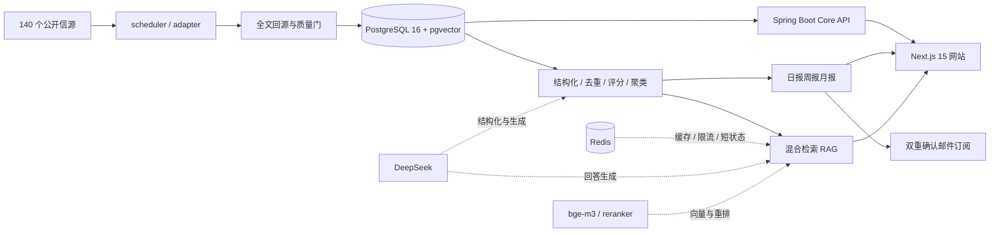

# AI Hot Radar

面向 AI 行业的时效性情报平台：统一采集 140 个公开信源，完成清洗、去重、结构化、
事件聚合与精选评分，产出网站与日报，并提供**每句话都能点回原文**的 RAG 问答。

当前状态：**M0–M5 首次生产闭环已完成，网站正在香港 2C4G 目标机持续运行**；
在线地址：[https://aihotradar.online](https://aihotradar.online)。Caddy 直接提供 HTTPS，
内部 API、PostgreSQL 与 Redis 均不暴露公网。语料每 120 秒轮询一次，2026-08-12 实测
生产快照为 **1927 条内容 / 7269 个分块（全部已向量化）/ 1511 个事件**。

---

## 产品一览

| 面向读者 | 面向工程质量 |
|---|---|
| 精选、全部动态、热点、事件、主题地图 | RAG 发布门禁、运行状态、生成模型配置、信源后台 |
| 日报 / 周报 / 月报、双重确认邮件订阅 | 90 题黄金集、逐轮实验、引用支持度与端到端延迟 |
| 多轮 RAG、句级引用、原文回跳、证据选择解释 | 管理 RBAC、审计、备份恢复、告警与不可变镜像发布 |


<details>
<summary>查看更多产品截图</summary>

**日报 / 周报 / 月报**


**可验证引用的 RAG 回答**


**固定数据集上的 RAG 发布门禁**


**随调度结果更新的信源后台**


</details>

## 业务与系统架构



关键边界：PostgreSQL 是唯一事实源；Redis 只做可丢失的缓存、限流和短状态；
RSS/列表摘要只能用于发现，最终证据必须回到原始正文；浏览器只访问 Next.js，
由服务端代理 Core API 与 AI Service。

---

## 这个项目想证明的一件事

RAG 很容易做成一个「看起来会答」的黑盒。这里的取向相反：
**每一个检索决策都要能被追问，每一个结论都要有可点开的出处，
量出来不好看的结果也要留在页面上。**

站内 `/eval` 页与 `docs/status/eval/` 保留全部检索、生成与延迟评测的逐题数据与判据，
其中**三轮是负结果**、**一条写下来的假设被下一轮证伪**：

| 轮次 | 做了什么 | 结果 |
|---|---|---|
| B2 | 稠密 + 稀疏并集 | **比纯稠密还差**，保留记录 |
| B8 | 扫 42 组融合权重 | 接上重排后差距塌缩到 **0.0004** → **结论：不改** |
| B13 | 修中文分词（CJK bigram） | RAG 端到端 **±0.0000**（稠密通道一直在兜底）；但站内搜索 **10–32×** |
| GEN | 生成侧首测 | 误拒率升到 7.69%，写下假设「语料增长导致证据位竞争」 |
| GEN-FIX | 抓原始模型输出复查 | **假设是错的**——是解析失败分支在丢答案，修完误拒率 **0.00%** |

最后一条是这个项目里最有代表性的一次排查：指标变化被归因给了一个听起来合理的原因，
下一轮把模型原始响应抓出来看，发现六道「拒答」题的答案**完整且正确**，
只是没套 JSON 外壳、或把引用编号写进了 `claims` 而不是正文——**在出口处被整个丢掉**。

## 关键指标（90 题黄金集，六类各 15 题）

**检索**（B1 纯稠密 → 08-11 当前 90 题发布轮）：Recall@20
**0.8876 → 0.8994**；15 题中文厂商名专项集为 **0.9333**，加入 8 个真实近邻噪声后
仍为 **0.9333**。

**生成**：

| | |
|---|---|
| 句级引用覆盖率 | **0.9881** |
| 段落级引用支持度达标率 | **0.9344** |
| 可答题误拒率 | **0.0000**（78/78） |
| 断言假前提（12 道诱导题） | **0 / 12** |
| 重复提问延迟 | 14171ms → **211ms**（freshness-aware 缓存） |

拒答率与误拒率**必须一起看**：全都拒答的系统在拒答指标上满分且毫无用处。

## RAG 是怎么做的

```
问题
 └─ 查询规划：问题类型 + 时间区间（"本周" → 真实日期区间）
 └─ 多路召回      稠密 pgvector/HNSW (60) + 稀疏 tsvector/GIN (40)
                  + temporal / subject 限定的 entity_temporal（有时间窗时）
 └─ 加权 RRF 融合（dense 1.0 / sparse 0.6 / temporal 0.15 / entity_temporal 1.0）
 └─ 交叉编码器重排（bge-reranker-v2-m3）+ 5 条元数据调整
 └─ 重排后维度：directness / source_fit / temporal_fit
 └─ 证据选择：同篇限流 → 同事件折叠 → 主源优先，上限 10 条
 └─ 三档自适应父块扩展
 └─ 生成 + 服务端引用绑定 + 4 条不变量校验
 └─ 逐条引用打支持度分（与离线评测同一个交叉编码器）
```

每次问答都写一条**检索轨迹**：每个候选在两个通道各自的名次与分数、
施加了哪几条调整、重排名次、以及**被淘汰的原因**（同篇超额 / 同事件折叠 / 预算已满，三者分开）。
`/ask/{id}` 上有「为什么是这几条证据」面板。

实测旗舰题：正确答案在**稠密通道排第 14、关键词通道排第 1、融合后第 3**——
这就是混合检索存在的理由，写在页面上而不是写在简历上。

## 技术栈

| 层 | 技术 | 说明 |
|---|---|---|
| 前端 | Next.js 15（App Router、SSR） | 浏览器不直接访问 core-api |
| 内容 API | Spring Boot 3 / Java 21 / Maven | 读接口、缓存、管理端鉴权 |
| AI 服务 | FastAPI / Python 3.12 | 采集、加工、RAG |
| 存储 | PostgreSQL 16 + pgvector | HNSW cosine；全文用 tsvector + CJK bigram |
| 缓存 | Redis | 读缓存、限流、RAG 三层缓存（不做真相来源） |
| 模型 | DeepSeek V4 Flash / Pro（生成）· 硅基流动 bge-m3 / bge-reranker-v2-m3 | 只切换 DeepSeek 生成模型；向量/重排固定 |
| 可观测 | OpenTelemetry（可选）· Jaeger（仅 dev） | 无端点时为 no-op |

**刻意不引入**：消息队列、MinIO、Elasticsearch、GraphRAG。
每一条都有 ADR 记录理由，见 `docs/adr/`。

## 快速开始

```bash
cp .env.example .env
```

填入 DeepSeek 与硅基流动的 API Key，然后：

```bash
docker compose -f infra/compose/docker-compose.yml up -d --build
```

网站 http://localhost:3000 ，内容 API :8080 ，AI 服务 :8000 。
Flyway 在 core-api 启动时自动迁移（V001–V024，含 V017.1 补序迁移）。

站内可看的页面：`/`（精选）· `/items` · `/hot` · `/stories` · `/topics` ·
`/reports` · `/ask`（RAG 问答）· `/eval`（RAG 质量）· `/ops`（运行状态）·
`/admin/models`（生成模型配置）· `/admin/sources`。

## 测试

当前三套单元/集成测试共 **1025 个**：Python 878 · Java 74 · Web 73；
另有 33 个浏览器 E2E 用例。Python 与 Java 大部分可断网通过。

```bash
cd apps/ai-service && python -m pytest -q && python -m mypy src
```

```bash
cd apps/web && npm run typecheck && npm run lint && npx vitest run
```

Java 侧需要 JDK 21；没有本机 JDK 21 时在容器里跑：

```bash
docker run --rm -v "$PWD/apps/core-api:/build" -v "$PWD/database/migrations:/build/src/main/resources/db/migration:ro" -w /build maven:3.9-eclipse-temurin-21 mvn -B test
```

## 还没做的（如实）

- **M5 已上线，不等于运维工作结束**：生产已按不可变 SHA 镜像运行，HTTPS、公网 smoke、
  真实 RAG、SMTP、故障/恢复告警、校验和备份与隔离恢复均已取得证据。仍需定期做供应商
  额度复核、异机副本检查、每月恢复演练与服务器迁移演练——见
  `docs/status/handoff-20260812.md`。
- **日报/周报/月报已启用非阻塞发布门和邮件订阅**：PUBLISHED 报告可在报告页通过邮箱
  双重确认订阅，按收件人时区每天 08:30 后投递；退订即时生效，同一期同一收件人只会建立
  一条投递事实。SMTP 失败最多重试三次且不阻塞 pipeline、站内发布、AI 动态或精选。
- **管理端写操作只有 API，没有浏览器 UI**。鉴权、二次确认、审计都已实现并实测，
  但把 OPERATOR 令牌放进 localStorage 需要单独想清楚 XSS 面（ADR-0019）。
- **`outbox_event` 只写不读**：`published_at` 全空、没有消费者。
  一致性目前由轮询保证。引入消费者的前提是有真正需要异步解耦的下游，目前没有。
- **通用 LLM 查询改写默认关闭**：厂商别名、实体与多轮指代改写已经上线；15 题专项集
  未证明额外在线 LLM 往返有收益，相关试验保持生产权重 0。
- **噪声门禁已有专项小样本，不等于广谱鲁棒性**：当前只覆盖 8 个真实近邻噪声；仍需
  扩大同名实体、别名、错别字、旧版本与跨语言改写样本。
- **Planner 的 query-type 代理不可作为发布判据**：89.7% 题型不改变 Recall；若保留
  该规格项，需要单独标注实体解析与时间窗，而不是用评测分类反推答案。

## 文档

- **[`docs/interview/README.md`](docs/interview/README.md)** —— 面试准备总入口：系统地图、数据与 RAG、生产运维、题库、简历与演示
- **[`docs/interview-guide.md`](docs/interview-guide.md)** —— 具体追问讲解稿，包含负结果、故障排查与技术取舍
- **`docs/status/project-status.md`** —— 全量进展、每一次排查的根因与实测数字（最值得读的一份）
- **`docs/status/handoff-20260812.md`** —— 当前生产提交、运行快照、已完成门禁和下一步顺序
- **`docs/status/rag-product-readiness-20260810.md`** —— 当前 RAG 全链路、成熟产品对标、评分与优化顺序
- **`docs/adr/`** —— 架构决策记录（ADR-0012 起），含被数据否掉的方案
- **`docs/spec/`** —— 锁定规格。冲突时优先级：`00-master-spec.md` 的锁定决策 >
  领域文档 > `config/*.yaml` > 执行器自己的建议

<details>
<summary>规格文件索引</summary>

| 文件 | 作用 |
|---|---|
| `docs/spec/00-master-spec.md` | 唯一总规格与决策基线 |
| `docs/spec/01-product-requirements.md` | 产品范围、页面与验收 |
| `docs/spec/02-system-architecture.md` | 服务边界、数据流与部署 |
| `docs/spec/03-data-ingestion.md` | 数据模型、采集和事件聚合 |
| `docs/spec/04-rag-agent-design.md` | 时间与事件感知 RAG |
| `docs/spec/05-api-contract.md` | HTTP 与内部任务契约 |
| `docs/spec/06-frontend-spec.md` | 路由、页面、组件和状态 |
| `docs/spec/07-quality-security-ops.md` | 测试、安全、版权和运维 |
| `docs/spec/08-roadmap-ai-ide.md` | 里程碑、任务卡和 AI IDE 规则 |
| `docs/spec/09-source-registry-fulltext.md` | 140 个信源、全文回源、状态机与验收 |
| `docs/spec/10-source-adapter-implementation.md` | 各类接口读取、字段映射与代码边界 |
| `docs/spec/11-end-to-end-runbook.md` | 从定时触发到网站/邮件/RAG 的完整链路 |
| `docs/spec/12-delivery-index.md` | 全部文件、用途与完成度 |
| `config/sources.yaml` | 140 个可执行采集入口 |
| `config/ingestion-profiles.yaml` | 9 类采集 Profile 的机器可读契约 |
| `config/taxonomy.yaml` | 分类、实体和内容类型 |
| `config/social-watchlist.yaml` | 受限监控目标 |
| `config/site-overrides.yaml` | 站点覆盖与启用门禁 |
| `database/migrations/` | Flyway 迁移，唯一可改 schema 的路径 |
| `api/openapi.yaml` | 公共、RAG 与管理 API 基线 |

规范词：**MUST/必须** 验收硬条件 · **SHOULD/应当** 偏离需记录原因 ·
**MAY/可以** 可选增强 · **OUT** 本版本明确不做。

不得静默改变技术栈、核心实体、API 语义与里程碑边界；确需改变时先加 ADR。

</details>
