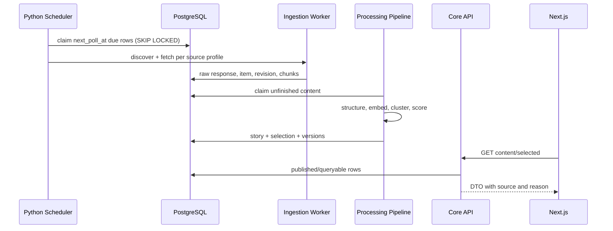
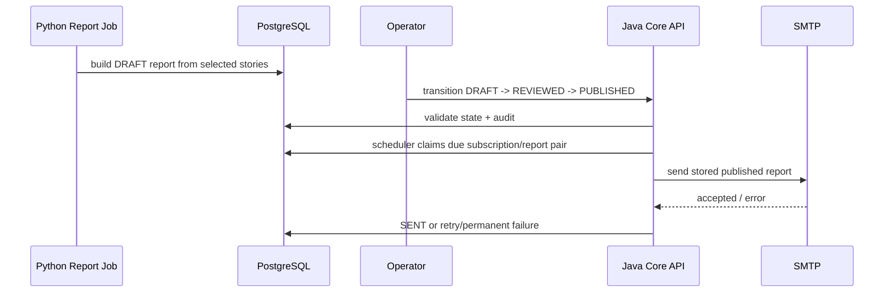
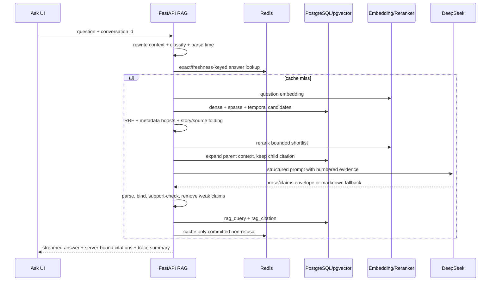

# 02｜四条端到端业务链路

## 1. 为什么按链路理解，而不是按目录背代码

一次用户行为会穿过多个语言、进程和表。只背“前端 Next、后端 Java、AI Python”无法回答：
数据在哪里提交、失败后是否重试、用户看到的是旧数据还是空白、哪个服务拥有事实。

## 2. 链路 A：公开信源到精选首页



关键提交点：

1. Scheduler 领取信源后立即把下次轮询时间后移，崩溃不会永久丢源；
2. Adapter 先保存原始响应和发现元数据；需要全文时继续回源；
3. Fulltext gate 拒绝导航页、短摘要或受限内容；
4. 规范化写入 item/revision/chunk，唯一键让同一批重放不重复；
5. Processing pipeline 结构化、向量化、聚类和精选；
6. Core API 只读已经达到页面语义的数据；Next 不直接访问数据库。

失败与降级：单个源失败只增加自身 failure/backoff；结构化失败保留原文待重试；精选旧批次
仍可读，不因为一个模型请求失败让首页消失。

## 3. 链路 B：内容到日/周/月报与邮件



这里有两条硬边界：

- 报告生成失败不阻塞资讯采集；
- 邮件发送时不重新调用 LLM，只渲染数据库中已发布的报告。

订阅申请先进入 pending request。确认 token 有有效期；确认后才创建 ACTIVE subscription。
`(subscription_id, report_id)` 唯一约束和 `FOR UPDATE SKIP LOCKED` 防止多实例重复发送。

## 4. 链路 C：用户问题到可验证 RAG 回答



回答的“出口门”比模型本身更重要：模型写出的 URL 和证据编号都不可信，服务端只接受候选
集合里存在的编号，并重新绑定 `content_chunk_id`。无法回答的问题应拒答，不能用行业常识补齐。

## 5. 链路 D：运营变更

高风险操作不是页面直接改表：

```text
VIEWER 读取当前状态
→ OPERATOR 携带 Bearer Token
→ 提供目标确认和幂等键
→ Core API 校验允许的状态迁移
→ PostgreSQL 事务写入
→ admin_audit 保存 before/after/actor/trace
→ 页面重新读取事实
```

模型切换只改变之后的生成请求，不重写历史内容，也不重建 embedding。信源启停、报告发布和
模型切换是不同的审计动作。

## 6. 跨链路一致性

| 事实 | 唯一拥有者 | 其他层如何使用 |
|---|---|---|
| 文章/事件/报告/订阅 | PostgreSQL | API 查询、任务读取 |
| 页面渲染状态 | Next.js | 可丢失、可重建 |
| 热缓存/限流/短会话 | Redis | 失败时回源或降级 |
| 模型输出 | 先不可信 | 校验后才入事实表 |
| 邮件供应商响应 | delivery 记录 | 重试/审计依据 |
| 历史评测 | 版本化 JSON/Markdown | 发布门，不是实时监控 |

## 7. 排障方法

面对“页面没更新”，按提交点向后查：

1. source 是否到期且被领取；
2. crawl/raw 是否产生；
3. fulltext gate 是否通过；
4. item/revision/chunk 是否持久化；
5. processing version 是否完成；
6. story/selection/report 是否生成；
7. API 是否返回；
8. Next 缓存和导航是否拿到新响应。

不要先重启所有容器。重启会消灭现场信息，也无法修复状态、约束或第三方拒绝。

