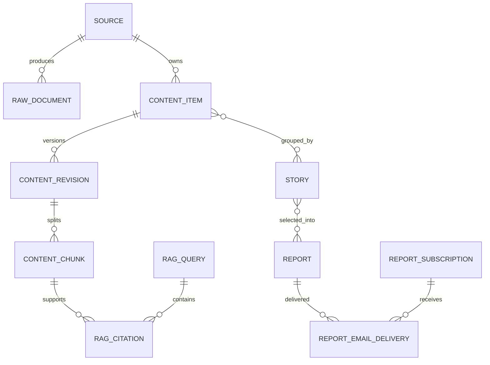

# 04｜数据模型与状态机

## 1. 数据模型围绕“证据演进”设计

普通 CMS 只需要文章。AI Hot Radar 还要回答文章从哪里来、正文哪版被处理、哪个段落支持答案、
多篇文章是否描述同一事件、报告是否发布、邮件是否已发送。因此物理模型分层保存而不是把
所有字段塞进一张 news 表。

## 2. 主要实体链

## 3. 来源与采集层

- `source`：配置镜像、优先级、运行状态、失败计数、`next_poll_at`；
- `source_cursor`/相关字段：ETag、Last-Modified、分页/时间游标；
- `crawl_run`：一次探测/采集的统计和错误；
- `ingestion_task`：可重入任务状态；
- `raw_document`：原始响应元数据、hash、解析状态和审计入口。

源注册表配置与数据库运行状态不是重复事实：YAML 描述“应该有哪些源和策略”，数据库描述
“这一部署中的启停、探测和运行结果”。同步过程必须可审计。

## 4. 内容与版本层

- `content_item` 是稳定业务身份，canonical URL/外部 ID/源关系在这里；
- `content_revision` 保存正文版本，避免更新覆盖掉曾经引用的输入；
- `content_chunk` 是当前物理 evidence passage，同时持有搜索向量与 embedding；
- chunk 的 `content_revision_id + ordinal` 保证定位和相邻 parent 展开。

为什么不把 AI summary 当 revision 正文：summary 是派生物，模型切换或 prompt 更新后可重建；
原始清洗正文才是引用和纠错依据。

## 5. 事件与精选层

- `story` 表示现实事件，而不是文章；
- `story_item` 保存主来源、支持、补充、评论等角色；
- `selection_record` 保存某日/某批选择分数、理由和版本；
- 人工锁定的 story 不能被下一轮聚类静默覆盖。

Story 聚类发生错误时应 split/lock 并保留审计，而不是删除原文章。

## 6. 报告、订阅与投递层

报告有 `DRAFT → REVIEWED → PUBLISHED` 等受控迁移。订阅请求与正式订阅分表，是因为“有人
输入了邮箱”和“邮箱所有者确认订阅”是两个业务事实。投递表以 subscription/report 组合唯一，
保存尝试次数、下次重试、最终状态和错误摘要。

## 7. RAG 层

- `rag_query` 保存原始问题、重写问题、计划、模型/语料版本、耗时和答案；
- `rag_citation` 绑定回答主张与 `content_chunk_id`；
- 证据 URL 通过 chunk → revision → item → source/canonical 解析，不信任模型直接给 URL；
- embedding 目前与 chunk 同行，不存在独立 `embedding_record`，见 ADR-0029。

## 8. 状态、版本和幂等的三层保护

| 风险 | 保护机制 | 例子 |
|---|---|---|
| 两进程同时领取 | 行锁/`SKIP LOCKED`/advisory lock | source、processing worker、delivery |
| 同一输入重复执行 | 唯一键/idempotency key | canonical、delivery、admin action |
| 旧结果晚到覆盖新输入 | input hash/processor version/CAS | enrichment、embedding、report |

幂等不等于“任务只执行一次”。系统允许至少一次执行，但相同业务效果只提交一次。

## 9. Outbox 和 processed_event

它们存在于基线迁移，但当前没有消费者。`outbox_event.published_at IS NULL` 不是故障队列积压，
而是预留架构尚未启用的直接证据。恢复依赖业务表状态和 cursor，不依赖 outbox 重放。

## 10. 数据库演进规则

- 只通过 `database/migrations/` 的 Flyway SQL；
- 已发布迁移不回写，新增迁移向前修复；
- Java/Python 共享类型需要同步契约；
- 索引先由真实查询和 `EXPLAIN` 证明；
- 删除字段要先停止读、再停止写、最后迁移；
- 备份验收不仅是“有文件”，还要能在隔离环境恢复并通过 smoke。

## 11. 代码走读

从 `database/migrations/V001__baseline.sql` 开始，按版本阅读。对每张表问四件事：谁写、谁读、
什么状态可见、怎么重放。然后对照 Python repository、Java JDBC SQL 和测试，确认没有只存在于
文档的实体。

