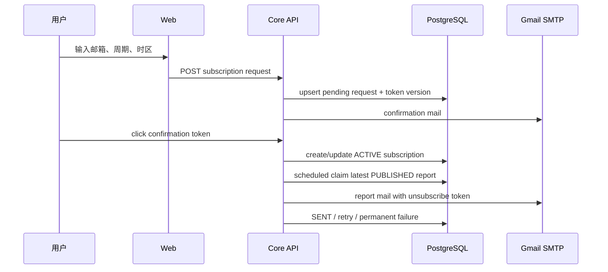

# 07｜日报、周报、月报、订阅与邮件

## 1. 报告不是临时页面拼接

日报、周报和月报是版本化业务实体。生成任务把已验证 story 编排成结构化报告，页面和邮件
读取同一份已保存内容。因此某次模型调用失败、生成模型切换或内容继续增长，都不会让已发布
报告在用户打开时悄悄改变。

## 2. 三种周期的差异

| 周期 | 主要问题 | 内容组织 |
|---|---|---|
| 日报 | 今天最值得知道什么 | 分类看点 + 条目 + 原文 |
| 周报 | 一周主线和相互关系是什么 | 主线、主题、趋势、代表事件 |
| 月报 | 哪些变化形成阶段性趋势 | 主题演进、公司/模型格局、风险与展望 |

周报/月报不应该只是把 7/30 份日报拼起来；它们以 story 去重，并在更长窗口重新组织主题。

## 3. 生成与发布状态机

```text
候选窗口锁定
→ story 去重和配额
→ 生成结构化报告 DRAFT
→ 引用/链接/条目完整性校验
→ REVIEWED
→ PUBLISHED
→ 页面可见且可进入邮件投递
```

正式发布需要受保护的管理接口、目标确认、幂等键和审计。模型输出不能直接跨过发布门。

## 4. 邮件订阅流程



用户输入邮箱后不会立即收到日报正文，而是先收到确认邮件。这样避免别人替他订阅、邮件轰炸和
地址拼写错误。十分钟内重复申请不重复发确认信；token 过期或版本不匹配会拒绝。

## 5. 投递幂等和重试

- `(subscription_id, report_id)` 唯一；
- delivery key 不包含明文邮箱；
- `FOR UPDATE SKIP LOCKED` 允许多实例安全领取不同投递；
- SMTP 失败记录有限长度错误，按 10/60 分钟等策略退避；
- 第三次失败进入永久失败，不能无限重试；
- 退订后待发送记录不会继续投递。

## 6. 邮件发送什么

发送的是已经 `PUBLISHED` 的日/周/月报告：标题、时期、栏目和条目摘要、站内报告链接、原文
来源链接、AI 生成提示与退订链接。不是每抓到一条资讯就推送，也不会在投递瞬间调用 LLM。

## 7. 时区和发送时间

订阅保存 IANA 时区和本地投递时间。调度查询使用 PostgreSQL 时区转换判断是否到点；报告的
period key 与订阅确认时间共同防止向新订阅者补发大量旧报告。

## 8. Core API 代码入口

- `ReportController.java`：公开报告列表、详情、导航和统计；
- `ReportAdminController.java` / `ReportPublicationService.java`：发布状态机；
- `ReportSubscriptionController.java`：申请、确认、退订；
- `ReportSubscriptionService.java`：token 和订阅事实；
- `ReportEmailDeliveryService.java`：定时领取、幂等与重试；
- `SubscriptionMailer.java`：纯文本/HTML 渲染与 SMTP。

Python 生成入口在 `apps/ai-service/src/ahr/processing/report.py` 和 CLI `report` 命令。

## 9. 常见设计追问

**为什么订阅在 Java，而报告生成在 Python？** 生成需要 NLP/模型工具链；订阅、token、投递和
审计是稳定业务状态，放在 Core API 更容易保持事务和 API 边界。

**为什么不用消息队列发邮件？** 当前量级通过 PostgreSQL delivery 表、锁和重试已能证明可靠；
引入 Broker 不会替代幂等、状态和死信设计，只会增加运维。出现持续投递积压再评估。
