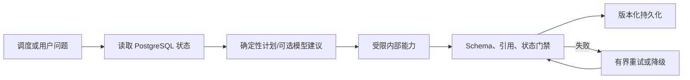

# Agent、编排、记忆与成本：当前能力和边界

AI Hot Radar 有“智能工作流”，但不是一个可以任意调用工具、自主循环数十步的通用 Agent。本章的
目标是把已实现能力、Agent 术语和未来演进条件分开，避免在面试中把普通 LLM 调用包装成 Agent。

## 1. 当前系统属于哪一种 Agent

更准确的定义是：**确定性工作流编排 + 若干受限的模型决策节点**。

系统不会把数据库、Shell、浏览器或外部任意 URL 暴露给模型。模型只能在代码预定义的节点中完成
结构化、改写、生成或审计，并且每个节点都有最大输入、超时、重试次数和输出 schema。

## 2. 五类“Agent 能力”逐项核对

| 能力 | 当前实现 | 边界 |
|---|---|---|
| 感知 | 采集适配器读取公开 Feed/API/HTML/GitHub/arXiv；RAG 读取版本化 chunk | 不是模型自主浏览，来源必须在 registry 和策略内 |
| 规划 | 调度器按租约和状态机规划任务；RAG 先做确定性意图/时间解析，可选 LLM planner | 没有无限 ReAct 循环；LLM planner 不是生产唯一入口 |
| 工具调用 | 代码显式调用全文抓取、Embedding、检索、rerank、生成、SMTP | 模型不能动态选择任意工具或拼接 SQL |
| 记忆 | PostgreSQL 保存内容版本、查询、引用和投递；Redis 保存短期会话和缓存 | 没有长期用户画像，也不把 Redis 当事实源 |
| 反思/验证 | schema 修复、数字审计、引用绑定、黄金集发布门 | 不是让同一个模型“自我感觉良好”；关键检查由代码与独立证据完成 |

## 3. RAG 的计划与工具编排

一个问答请求的受控步骤如下：

1. Core/Web 只负责同源入口和展示，FastAPI 接收问题；
2. 限流、输入长度和危险参数校验先于模型调用；
3. `planner.py` 用确定性规则识别 query type、厂商实体、日期和“最近”语义；
4. 查询改写器只看最近问题和历史引用标题，产生独立检索句；原始问题始终保留；
5. dense、sparse、temporal/entity 通道并行召回；
6. RRF 融合、交叉编码器重排、元数据小幅调整；
7. 在父段预算内补上下文，构造带编号证据；
8. 生成模型输出结构化 claims 和 evidence ids；
9. 服务端校验编号、支持度和数字断言，决定完整回答、部分回答或拒答；
10. PostgreSQL 保存问题、计划、检索 trace、答案和引用，Redis 只保存短期 transcript/cache。

这是一张有向无环执行图，而不是开放式 Agent loop。好处是每一步都有可重放输入和耗时，坏处是新工具
必须显式编码。对于资讯问答，这个取舍比“让模型自由决定下一步”更安全、成本也更稳定。

## 4. 记忆如何设计

### 4.1 语料记忆

`content_item` 标识逻辑内容，`content_revision` 保存每次正文版本，`content_chunk` 保存某个 revision 的
不可变分块集合。PostgreSQL 是长期记忆和事实源；正文、出处、时间和证据定位不会因为 Redis 过期而丢失。

### 4.2 会话记忆

会话 transcript 在 Redis 中保存约 2 小时，只取最近约 6 轮辅助指代消解。改写器接收的是历史问题和引用
标题，不直接把旧模型答案当事实传入下一轮。这解决了两个风险：错误答案不会被下一轮自我强化；会话过期
不会影响审计，因为最终查询、引用和答案仍在 PostgreSQL。

### 4.3 为什么没有“长期用户记忆”

当前产品没有登录账号和明确的个性化同意机制。保存用户兴趣、身份或历史问题会带来隐私、删除权和访问
控制要求，而业务收益尚无数据支持。因此没有长期画像是主动边界，不是遗漏。未来若增加账号，应先设计
同意、保留期、导出/删除和租户隔离，再考虑向量化用户记忆。

## 5. 跨语言通信如何实现

这里有两种“跨语言”：

1. **Java/Python 服务通信**：不是内存 RPC，而是 HTTP API + PostgreSQL 共享事实。公开契约和生成类型
   限制字段漂移，Flyway 管理数据库演进；Java 不导入 Python 对象，Python 不绕过 Core API 修改订阅权限。
2. **中英文检索**：多语 Embedding 处理语义，PostgreSQL sparse 通道守住英文型号；查询规范化保留原始
   型号、版本和专名，避免中文分词把 `MXFP4`、`Qwen3.5` 等破坏。

共享数据库的风险是服务边界模糊。项目通过“谁拥有写语义”约束：采集/RAG 表由 AI Service 工作流维护，
订阅、发布和权限由 Core API 维护；Redis 不承担跨服务最终一致性。

## 6. 性能和成本编排

模型调用是最慢、最贵、最不稳定的环节，因此成本控制不是最后加一个仪表盘：

- 采集与原文入库不依赖每个 LLM 调用都成功；失败可稍后 enrichment；
- content hash 与 revision 防止相同正文重复结构化、切块和 Embedding；
- Embedding 缓存约 7 天，答案缓存约 1 小时，语义复用阈值约 0.97；
- rerank 候选通常上限 40，简单意图可降到 20；证据通常最多 10 段；
- 父段展开有约 2000 token 预算，证据单段送模约 1200 字符；
- 会话只取有限轮数，避免 Prompt 随对话无限增长；
- 外部调用有连接/读取超时、只对超时、429 和 5xx 做有界重试；
- `llm_usage` 记录 provider/model、输入/缓存命中/输出 token、延迟和操作类型，用于真实价格表换算。

降级顺序也被限定：缓存命中 → 正常 provider → 有界重试/已配置故障切换 → 保留结构化失败或拒答。
系统不会为了“看起来有回答”在证据不足时切换到无引用常识模式。

## 7. 为什么现在不引入 LangChain/LangGraph

当前实现没有必要为“使用框架”而重写。原因：

- 执行图稳定且步骤有限，普通 Python 模块已经清晰；
- 自定义 SQL、RRF、版本化 chunk、引用绑定和评测是核心差异，框架不能替代；
- 直接 Pydantic/httpx 更容易控制超时、重试、trace、缓存键和失败语义；
- 引入框架会增加版本、序列化、回调和隐式重试层，给 2C4G 单机增加排障成本；
- 项目没有多租户 Agent、几十种动态工具或长时间可恢复工作流的真实压力。

触发引入 LangGraph/类似框架的条件应是：出现多分支、可暂停恢复、人工审批、并行工具和补偿事务，并且
手写状态机已经成为主要维护成本。即使触发，也应先做小规模对照，保留现有 retrieval 和 validation 模块，
而不是把业务事实迁入框架内存。

## 8. 真实困难与解决方式

### 8.1 模型 JSON 失败被误判为“无法回答”

早期生成评测中，模型正文可能完整正确，但外层没有 JSON，或者证据编号只写进 `claims[].evidence_ids`。
解析器把这种契约失败当成空答案，造成误拒。修复是受限正文回退 + 同一套引用校验，而不是放松证据门。
修复后 90 题误拒从 7.69% 回到 0，但引用支持仍由服务端检查。

### 8.2 多轮对话污染检索

若把上一轮完整答案拼入查询，模型幻觉会进入检索。现在只使用最近问题和已绑定引用标题作消歧，原问题
始终保留，并限制轮数和 TTL。

### 8.3 模型切换与向量索引耦合

生成模型可以通过数据库配置切换并重跑生成门；Embedding 模型不能原地替换，因为新旧向量不可比较。
因此 Embedding 固定并需要版本化重嵌入计划。这个边界比做一个“任意模型下拉框”更重要。

## 9. 面试追问

**Q：你的项目算 Agent 吗？**

A：算受控 workflow agent，不是通用自治 Agent。它有感知、计划、受限工具、短期记忆和验证，但执行图、
最大步数和工具集合由代码确定，适合高可追溯资讯场景。

**Q：为什么记忆放 Redis，而又说 PostgreSQL 是事实源？**

A：Redis 只存可丢失的短期 transcript 和缓存；问题、答案、引用、内容版本与投递状态在 PostgreSQL。
Redis 清空只影响性能和多轮便利，不影响事实与审计。

**Q：怎样防 Prompt injection？**

A：采集正文被标记为数据而非指令；模型没有任意工具权限；输出 schema、证据编号和 URL 在服务端校验；
敏感管理接口不经过 RAG。不能声称完全消灭 injection，但可把影响限制在一次不可信生成中。

**Q：如果扩展到百万文档和高并发怎么办？**

A：先按 profile 拆读写和 worker、增加队列与批量 Embedding，再以真实基准决定是否把向量检索迁出
PostgreSQL。Agent 框架不是扩容手段；队列、索引分片、缓存和资源隔离才是。
