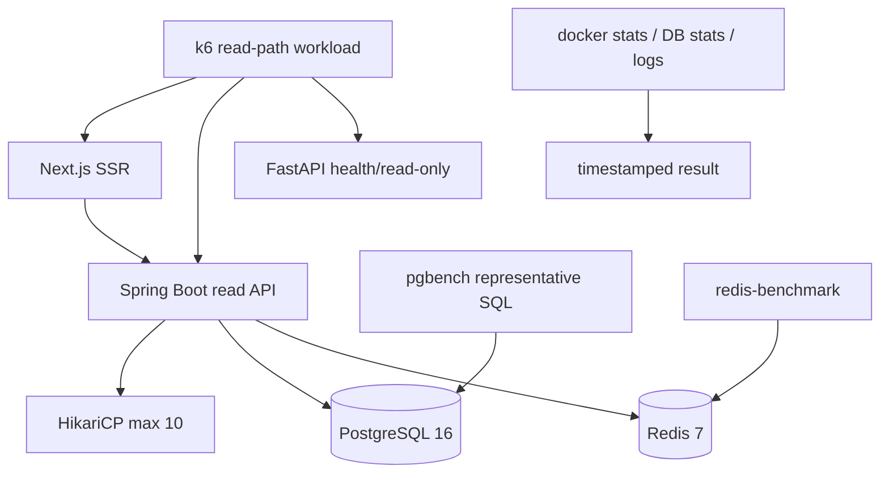

# 性能、容量与压测：如何得到可复现 QPS

“接口很快”和“能扛多少 QPS”都不是架构图能推出的结论。QPS 必须绑定硬件、数据量、请求组合、并发、
持续时间、缓存冷热、错误率和延迟分位数。本项目提供三层测试，而不是拿 `ab` 对一个健康检查打出虚高数字。

## 1. 压测目标与边界

分三类回答：

1. **容量**：在给定延迟和错误率 SLO 下，每秒能完成多少代表性请求；
2. **瓶颈**：Web SSR、Java、Python、PostgreSQL、Redis、外部模型哪个先饱和；
3. **回归**：一次代码或索引变化是否让 P95、吞吐、连接池或资源占用恶化。

公开生产站不做未经隔离的压力测试；会触发 DeepSeek/SiliconFlow/SMTP 的路径默认不压，以免制造费用和
副作用。生产级容量数据应在与目标机同规格的隔离环境、生产数据副本和假模型/回放服务上测。

## 2. 工具选择

| 工具 | 用途 | 为什么选/不选 |
|---|---|---|
| k6 | 多页面、多 API、阶段并发、阈值和标签 | 主场景工具；脚本可版本化，能同时量 Web/Core/AI |
| pgbench | 代表性只读 SQL、连接数和 TPS | 隔离 PostgreSQL，避免把 Web 序列化时间算成数据库时间 |
| redis-benchmark | PING/GET/SET 原语基线 | 快速发现 Redis 或网络异常；不能代表整个业务缓存命中率 |
| wrk/wrk2 | Linux 上单接口高吞吐和恒定到达率 | 可做补充；Windows/Docker 可移植性和业务断言弱于 k6 |
| ApacheBench | 最简单单 URL 烟测 | 不适合多步骤、标签、阈值、缓存冷热和业务正确性检查 |

因此不是“必须用 wrk 或 ab”。面试中更重要的是场景与方法正确。仓库入口见
[`../../infra/loadtest/README.md`](../../infra/loadtest/README.md)。

## 3. 分层压测架构

### 3.1 端到端读路径

`read-paths.js` 混合首页、内容流、主题、报告、问答入口和多个 Core API。每个响应既检查状态码也检查
业务可读性；Web、Core 分别打标签，避免总体 P95 掩盖慢层。smoke profile 用于验证脚本，baseline profile
分阶段爬升到 20 VU。

### 3.2 PostgreSQL

`postgres-feed.sql` 复现公开内容流的核心形态：过滤已发布状态、按发布时间倒序、限制返回行。测试前后应看
活动连接、慢查询、buffer hit 和锁等待。当前 Hikari 最大池 10，所以端到端并发超过 10 不等于数据库会
建立同样数量连接；请求会排队，P95 会先上升。

### 3.3 Redis：它在项目里到底做什么

Redis 有四类职责，但都不是业务事实源：

1. Spring Cache 缓存精选、主题、统计和报告，TTL 为 2–10 分钟，miss 回 PostgreSQL；
2. RAG 缓存问题 embedding 7 天、可验证答案 1 小时、会话热副本 2 小时和 suggestion 1 天；
3. 以严格 0.97 阈值保存最多 200 条语义近似问句索引，并以语料 fingerprint 防止跨版本复用；
4. 匿名问答分钟/天限流、RAG hit/miss 计数，以及本轮新增的 30 秒运行统计读模型。

PostgreSQL 仍保存内容、chunk、答案、引用、会话和用量；Redis 清空只造成慢一次或限流短暂 fail-open，
不会丢业务数据。生产使用 128 MiB `allkeys-lru` 与 192 MiB 容器上限；本地保持无上限便于调试。

原语基准只回答 Redis 本身是否异常。真实缓存还要分冷/热请求比较，并观察 key 数、内存、
`keyspace_hits/misses`、eviction 和 TTL。累计 hit/miss 不是某次压测命中率，必须在测试前后取差值。

### 3.4 Python 与外部模型

FastAPI 当前容器是单 Uvicorn worker。CPU 型解析和外部模型等待的饱和方式不同：前者受单核限制，后者受
连接池、provider 限流和超时限制。压生成路径时必须使用 mock/replay provider，分开统计 embedding、rerank、
generate，随后再用极小真实 canary 验证供应商延迟，不能把付费 API 当压测靶场。

## 4. 2026-08-13 本地基线

完整证据见 [`../status/loadtest/2026-08-13-local-baseline.md`](../status/loadtest/2026-08-13-local-baseline.md)。
本机为 14 核/18 线程开发机、Docker 约 15.35 GiB 内存限制，不是生产 2C4G：

| 层 | 请求/配置 | 结果 |
|---|---:|---:|
| k6 smoke | 2 VU、10 秒、339 请求 | 0 错误，33.6 req/s，总体 P95 45.69 ms |
| k6 baseline | 阶段爬升至 20 VU、90 秒、12,407 请求 | 0 错误，123.89 req/s，总体 P95 209.32 ms |
| Core API 标签 | 同一 baseline | P95 41.62 ms |
| Web SSR 标签 | 同一 baseline | P95 510.15 ms |
| pgbench | 10 clients、2 threads、30 秒 | 12,220 TPS，平均 0.818 ms，0 失败 |
| Redis PING | 100,000、20 clients | 约 63.9k–78.8k req/s，P50 0.10–0.12 ms |

TASK-M5-020 复测中，RAG 统计四条 SQL 的组合事务约 1,080 TPS/9.26 ms；`/rag/stats` 加
`to_thread + single-flight + Redis 30 秒 TTL` 后，20 VU 的 AI P95/P99 从 838/4046 ms 降为
11.21/18.77 ms，整轮从 69.0 升到 154.9 HTTP req/s。这里的收益来自避免 event loop 阻塞与重复
聚合，不是 Redis PING 有多快。

第一版 Python 腿只是 readiness。改为真正读取 `/rag/stats` 后，20 VU 复跑 6,849 请求、0 HTTP/业务
错误、66.34 req/s；Core P95 46.59 ms、Web P95 528.41 ms，AI 控制路径 P95 **918.94 ms**，越过
750 ms 门并让整轮正确失败。Web 与 Core 峰值 CPU 都超过一个逻辑核，PostgreSQL 次之，Redis 远未饱和。
可得结论是 SSR 与 RAG 统计聚合应优先 profile，而不是换 Redis；不能声称“线上 2C4G 可扛 124 QPS”。
最后一轮补齐 P99 后，Core P95/P99 42.86/56.04 ms、Web 511.23/596.27 ms、AI 控制路径
837.99/4046.49 ms；AI 聚合长尾是可重复的红灯而非一次偶发值。

## 5. 如何做真正的 2C4G 容量测试

1. 从生产备份恢复到隔离 2C4G，脱敏订阅邮箱和管理 token；
2. 使用与生产相同 SHA 镜像、Compose 限额、PostgreSQL 参数和数据规模；
3. 预热 5–10 分钟，记录冷缓存和热缓存两组；
4. 采用恒定到达率或 5/10/20/30/... VU 阶梯，每档至少 10 分钟；
5. 定义停止条件：错误率 >1%、P95 超 SLO、连接池持续满、swap/oom、队列持续增长；
6. 每档记录吞吐、P50/P95/P99、CPU、RSS、GC、连接池、DB locks/cache hit、Redis eviction；
7. 以满足 SLO 的最高稳定档作为容量，不取瞬时峰值；
8. 做一次 1–2 小时 soak test，排查内存增长、连接泄漏和缓存无界增长；
9. 在容量上保留至少 30% 余量，再据业务峰值计算实例数。

推荐初始 SLO：公共 Core API P95 <750 ms、SSR P95 <1.5 s、错误率 <1%。这只是初始工程门，不是用户
合同；应由真实流量和产品目标校正。

## 6. 常见错误与项目对应方案

| 错误 | 后果 | 本项目做法 |
|---|---|---|
| 只压 `/health` | 得到框架/网络极限而不是业务容量 | 混合页面和数据库读 API |
| 用平均延迟 | 长尾被掩盖 | 强制看 P95/P99 和 max |
| 不检查响应 | 404/500 也被算高吞吐 | k6 checks + error threshold |
| 边压边调用付费 LLM | 成本、限流和结果不可复现 | mock/replay，真实 provider 只做 canary |
| 在生产公网直接压 | 影响用户、触发防护 | 隔离同规格环境 |
| 把开发机结果写进简历 | 数据不可辩护 | 明确环境，生产数字待 2C4G 复测 |
| 只看 QPS 不看资源 | 无法定位瓶颈 | docker stats + DB/Redis/GC 指标 |

## 7. 面试回答模板

**Q：项目 QPS 是多少？**

A：先给测试环境和 SLO。本地 14 核开发环境的混合读场景在 20 VU、90 秒内完成 12,407 请求，约
123.9 req/s，错误率 0、总体 P95 209 ms；其中 Core P95 41.6 ms、Web SSR P95 510 ms。这是回归基线，
不能外推 2C4G。生产容量需在隔离同规格副本跑阶梯和 soak，取满足 SLO 的最高稳定档。

**Q：为什么不用 ab？**

A：ab 适合单 URL 烟测，但无法表达多个业务路径、分阶段负载、标签和响应断言。主测试用 k6，数据库和
缓存分别用 pgbench/redis-benchmark；需要 Linux 单端点极限时可补 wrk2。

**Q：数据库 TPS 很高，为什么网站还慢？**

A：代表 SQL 的热缓存 TPS 只说明该查询不是首要瓶颈。端到端还包含 SSR、Java 序列化、连接池排队、
网络和多个查询。本地数据显示 Web P95 远高于 Core，应该先 profile SSR 和请求瀑布，而不是仅调 PostgreSQL。

**Q：怎样压 RAG？**

A：拆成检索-only、rerank、生成三层。检索用固定查询集量吞吐和质量；rerank/生成先对 mock/replay 测系统
并发，再少量真实 provider 测外部延迟和限流。性能测试必须同时守住引用质量，不能只追求 QPS。

**Q：Redis 挂了会怎样，为什么不用它存会话真相？**

A：公共读缓存和 RAG 缓存 miss 后都回 PostgreSQL，答案、引用和会话物理行仍在数据库。限流为了可用性
会短暂 fail-open，因此另外用 PostgreSQL `llm_usage` 的每日 token ceiling 控制总预算。若把 Redis 当会话
事实源，重启和 LRU eviction 会直接丢用户历史，也无法与引用事务一致，这违反 ADR-0005。
