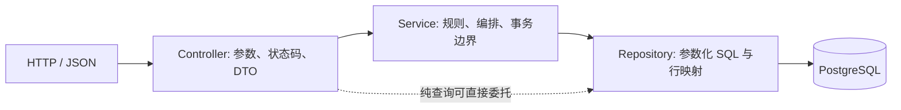

# 19｜后端分层、生产 JVM 与 Redis 实现

本文回答四个容易被代码目录误导的问题：Java 为什么没有全局 `controller/service/dao/entity`
四个大包，Python 是否真的使用 FastAPI，两端的边界如何被测试约束，以及生产机器上的 JVM 与
Redis 到底怎样运行。动态数字均带测量日期，不把腾讯云备案中的目标机写成当前生产事实。

## 1. 总原则：按业务域组织，域内再分层

项目没有采用下面这种全局技术目录：

```text
controller/
service/
dao/
entity/
```

这种形式在小型 CRUD 教程中直观，但业务增长后，一个 Story 改动会同时跨四个相距很远的目录。
本项目采用 package-by-feature：

```text
com.aihotradar.coreapi/
  content/       资讯、Story、报告公开读模型
  subscription/  订阅确认、退订、定时邮件投递
  admin/         管理鉴权、审计、信源与模型/报告管理
  cache/         Redis 公共读缓存配置
  health/        live/ready
  observability/ request id 与日志
```

每个业务域内部仍有明确职责：



“纯查询可直接委托”只适用于没有业务状态迁移的简单读模型；Controller 仍不能直接创建或依赖
`JdbcTemplate`。`CoreApiArchitectureTest` 用 ArchUnit 固化了这条边界。Story 和 Report 已将
原本位于 Controller 的 SQL、查询和组装拆到 Repository/Service；信源管理 SQL 收敛到
`SourceRepository`。这是真实依赖边界，不是仅重命名文件。

## 2. Java Spring Boot 端负责什么

Core API 是面向读者和运营动作的稳定事务边界：

| 业务 | 入口 | Service/Repository | 关键数据库事实 |
|---|---|---|---|
| 内容/主题公共读取 | `ContentController` | `ContentRepository` | PUBLISHED 内容、分类、厂商关系 |
| Story 事件读取 | `StoryController` | `StoryService`、`StoryRepository` | Story 与时间线成员 |
| 日/周/月报告 | `ReportController` | `ReportService`、`ReportRepository` | PUBLISHED 报告快照与条目 |
| 邮箱订阅 | `ReportSubscriptionController` | `ReportSubscriptionService` | pending/active/unsubscribed |
| 定时投递 | `ReportEmailDeliveryService` | 显式 SQL + SMTP | delivery 唯一键、重试状态 |
| 报告发布 | `ReportAdminController` | `ReportPublicationService` | DRAFT/REVIEW/PUBLISHED 状态机 |
| 信源管理 | `SourceAdminController` | `SourceRepository`、`AdminAudit` | enabled override、next poll、审计 |
| 模型配置 | `GenerationModelController` | `GenerationModelService` | 模型白名单、激活版本、审计 |

Java 不负责网页回源、正文抽取、Embedding、reranker 或 RAG 生成；这些变化快、依赖 Python AI/NLP
生态的能力在 AI Service。Java 也不是“只做代理”：报告发布、订阅确认、投递幂等、权限和审计都
是需要数据库一致性的业务规则。

## 3. 为什么没有 JPA `@Entity`

数据库当然有实体，但代码没有为了形式创建 JPA Entity。当前使用 Spring JDBC 与显式 SQL，原因是：

- 查询大量使用 PostgreSQL CTE、窗口函数、JSON 聚合、`FOR UPDATE SKIP LOCKED` 和 pgvector；
- 页面读模型和表结构不是一对一关系，一个响应常由报告、条目、来源和导航聚合而成；
- 显式 SQL 便于解释过滤条件、索引和执行计划，也避免 ORM 的 N+1 与隐式懒加载；
- 数据库结构由 Flyway V001–V026 定义，Java record 是接口读模型，不冒充持久化领域实体。

因此本项目中的 Repository 相当于 DAO，但命名强调它服务于一个业务聚合/读模型。若未来普通
CRUD 大量增长，可以局部引入 Spring Data JDBC/JPA；不能仅因面试官熟悉四层目录就整体改写。

## 4. 一次 Java 请求如何执行

以 `/api/v1/reports/{period}/{key}` 为例：

1. `ReportController` 接收 path parameter，只做 HTTP 映射；
2. `ReportService` 规范化周期、限制数量、决定章节名称并组装阅读统计；
3. `ReportRepository` 用参数化 SQL 读取报告主记录、条目和前后导航；
4. 只允许读取 `PUBLISHED` 快照；找不到映射为 404；
5. 不在请求时重新调用 LLM，所以网页与邮件看到的是同一发布事实。

以信源“立即运行”为例，Controller 不直接抓网站。`SourceRepository.scheduleNow()` 只把
`next_poll_at` 提前，真正回源仍由 Python Scheduler 通过同一套超时、SSRF、限速和全文门执行。
这样避免出现第二套没有安全门的采集路径。

## 5. Python 侧确实使用 FastAPI，但 FastAPI 不是整个架构

Python 3.12 的同一个构建产物承担三个进程角色：

| 角色 | 启动命令 | 职责 |
|---|---|---|
| `ai-service` | `uvicorn ahr.main:app ...` | `/health`、RAG HTTP/SSE、运行统计 |
| `scheduler` | `python -m ahr.cli schedule ...` | 领取到期信源、发现、回源、全文门 |
| `pipeline` | `python -m ahr.cli pipeline ...` | 结构化、分块、向量、聚类、精选、报告 |

目录不是 MVC，而是三个领域包：

```text
ahr/
  ingestion/   adapter、HTTP、全文门、repository、scheduler
  processing/  schema、chunk、story、selection、report、worker
  rag/         planner、retrieval、fusion、rerank、answer、eval
  main.py      FastAPI 组合根
  health.py    健康 HTTP 适配
  cli.py       后台/运维入口
```

每个领域内再区分：transport（`rag/api.py`）、application orchestration（`rag/service.py`、各
pipeline/worker）、domain policy（planner/fusion/safety/schema）和 infrastructure
（repository/http/llm/embeddings/cache）。FastAPI 只允许出现在 `main.py`、`health.py` 和
`rag/api.py`；AST 架构测试禁止 transport 框架渗入领域代码，并禁止 ingestion 反向依赖
processing/rag、rag 依赖 ingestion。

不用把 Python 再复制成 Java 风格的 `controller/service/dao/entity`。Python 的 adapter、Pydantic
schema、repository 和 pipeline 已表达相同职责；强行统一文件名不会减少跨语言复杂度。

## 6. Java 与 Python 如何协作

- 浏览器经 Next.js 同源代理访问 Java 公共 API或 Python RAG API；
- 后台进程通过 PostgreSQL 状态/租约协作，不把 Python 对象传给 Java；
- OpenAPI、JSON Schema、Pydantic 与生成 DTO约束跨语言字段；
- PostgreSQL 是唯一事实源，Redis 不承担跨服务最终一致性；
- `outbox_event` 当前只写不读，后台编排是数据库轮询，不能把预留表讲成 Kafka。

跨语言最大风险是“双方都以为对方做了某件事”。因此请求 ID、错误码、可信代理头、时间语义、
schema diff 和 Compose smoke 比共享一个抽象基类更重要。

## 7. 当前生产服务器与 JVM（2026-08-14 实测）

当前线上不是腾讯云广州机，而是香港主机：

| 项目 | 当前事实 |
|---|---|
| 宿主机 | Ubuntu 22.04.5 LTS，2 vCPU，标称 4G、系统可见约 3.4 GiB |
| 编排 | Docker Compose，10 个容器，Caddy 唯一公网入口 |
| Core API | Java 21 Temurin，容器 `mem_limit: 512m` |
| JVM 命令 | `java -XX:MaxRAMPercentage=75 -jar app.jar` |
| 最大堆 | 同容器参数实测估算约 371.25 MiB，不是宿主机的 75% |
| 数据库 | PostgreSQL 16 + pgvector，640 MiB 容器上限 |
| Redis | Redis 7，192 MiB 容器上限，128 MiB 数据上限，allkeys-lru |
| AI/API | ai-service 448 MiB；scheduler/pipeline 各 320 MiB |

为什么不用固定 `-Xmx384m`：百分比能随容器限额一起调整，Compose 的硬上限又避免按宿主机容量
错误放大。JVM 除 heap 外还需要 metaspace、线程栈、code cache、direct buffer 等 native memory，
所以 512 MiB 容器不能把 heap 顶到 512 MiB。若出现 OOM，应先区分 Java heap OOM、容器 OOMKill
和 PostgreSQL/系统内存压力，再决定调堆或扩容。

2026-08-14 读取时 Core API 约 278 MiB/512 MiB，Scheduler 约 269 MiB/320 MiB；这是瞬时观察，
不是容量承诺。已有 1→2→5 VU 低风险生产验证，不等同于容量寻顶。

## 8. Redis 到底在哪里工作

Redis 是可丢弃的性能与配额层：

### Java 公共读缓存

Spring Cache 对精选/热点、主题/分类、统计和报告类读模型设置 2–10 分钟短 TTL。缓存 miss 回
PostgreSQL，null 不缓存。值使用受限多态 JSON 序列化；曾经因为 Java record 是 final 而缺失类型
头，表现为“第一次成功、第二次缓存命中 500”，现由序列化往返测试保护。

### Python RAG 缓存

1. query embedding：模型+规范化问题键，7 天 TTL；
2. 精确答案：问题+Prompt+pipeline version+corpus fingerprint，1 小时 TTL；
3. 语义近似答案：相似度至少 0.97，且必须同 corpus fingerprint；
4. `/ops` 聚合快照：30 秒 TTL，并有进程内 single-flight 防并发击穿；
5. 多轮 transcript：短期读取加速，最终问答事实仍落 PostgreSQL。

拒答不缓存，因为“当前语料没有答案”最容易随新内容到达而失效。需要新鲜度的问题使用精确语料
指纹，原理/对比类使用按日指纹；缓存丢失只增加第三方调用、数据库负载和延迟。

### 匿名限流

`/ask` 使用固定分钟/日窗口，生产默认每调用方 3 次/分钟、20 次/日。它保护供应商费用，不是登录
安全边界，因此 Redis 故障时 fail-open；真正的全站日 token 预算仍记录在 PostgreSQL/provider
usage，而不是依赖可清空的 Redis。

## 9. 部署与备案状态

GitHub Actions 在通过门禁后构建 Core API、AI Service、Web 三张 `sha-<commit>` GHCR 镜像。
生产机 fast-forward 仓库以取得 Compose/脚本，但运行的是指定 SHA 的镜像，不在 2C4G 主机编译。
Caddy 自动 TLS；PostgreSQL/Redis/Internal API 只在 Compose 网络内；每日 `pg_dump -Fc` 带
SHA-256，恢复验证独立执行。

腾讯云广州 Ubuntu 24.04 处于 ICP 备案等待阶段。域名和网站名与机器解耦，备案完成后可按“新机
加固 → 同 SHA 部署 → 数据库校验恢复 → 临时入口 smoke → DNS 切换 → 旧机保留回退”迁移，
无需改业务名称或重写应用架构。

## 10. 本轮架构门禁

```bash
# Java 21
cd apps/core-api
mvn -B test

# Python 3.12
cd apps/ai-service
python -m pytest -q
python -m mypy src
python -m ruff check .
```

当前证据：Java 84/84；Python 916 通过、2 跳过；mypy 87 个源文件零错误；Ruff 通过。架构测试
防止 Controller 重新直接使用 JDBC，也防止 FastAPI 与领域依赖方向回退。
