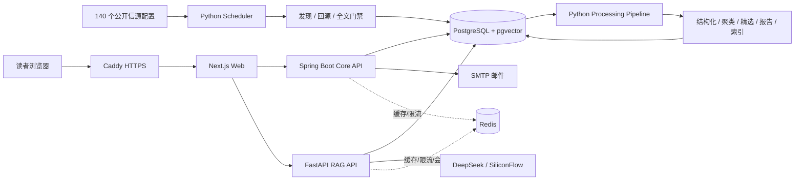

# AI Hot Radar 工程手册

这不是 README 的加长版，而是从业务问题一路走到代码、数据、运行和取舍的系统教材。
阅读时始终区分三种事实：

- **当前实现**：能在代码、Flyway、Compose 或测试中定位；
- **已接受决策**：由 `docs/adr/` 约束，但不等于所有目标能力都已落地；
- **未来候选**：只有触发条件满足后才进入任务卡，不包装成现有能力。

## 推荐阅读路线

### 第一次：建立全局地图（约 90 分钟）

1. [01 产品与业务架构](01-product-and-business.md)
2. [02 四条端到端业务链路](02-end-to-end-flows.md)
3. [03 运行时与服务架构](03-runtime-and-services.md)
4. [04 数据模型与状态机](04-data-model-and-state.md)
5. [08 RAG 索引与检索](08-rag-indexing-and-retrieval.md)
6. [09 RAG 生成、引用与安全出口](09-rag-generation-and-citations.md)

### 第二次：沿代码走读（约 4 小时）

- 采集：[05 信源与采集](05-source-ingestion.md)
- 内容：[06 内容加工、聚类与精选](06-content-story-selection.md)
- 报告：[07 报告、订阅与邮件](07-reports-and-email.md)
- 评测：[10 RAG 评测与发布门](10-rag-evaluation.md)
- 三端：[11 Java Core API](11-java-core-api.md)、[12 Python AI Service](12-python-ai-service.md)、
  [13 Next.js Web](13-nextjs-web.md)

### 第三次：工程化和面试（约 3 小时）

- [14 部署、安全与运维](14-deployment-security-ops.md)
- [15 测试、权衡、边界与演进](15-testing-tradeoffs-roadmap.md)
- [面试教材](../interview/README.md)

## 一张总图

## 代码阅读约定

- 所有相对路径均以仓库根目录为基准；
- 数据库结构只以 `database/migrations/` 为准；
- 生产进程只以 `infra/compose/docker-compose.prod.yml` 为准；
- RAG 发布质量看版本化评测和人工审计，不看页面观感；
- 动态计数必须带日期和环境，不能背成长期常量。

