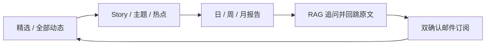
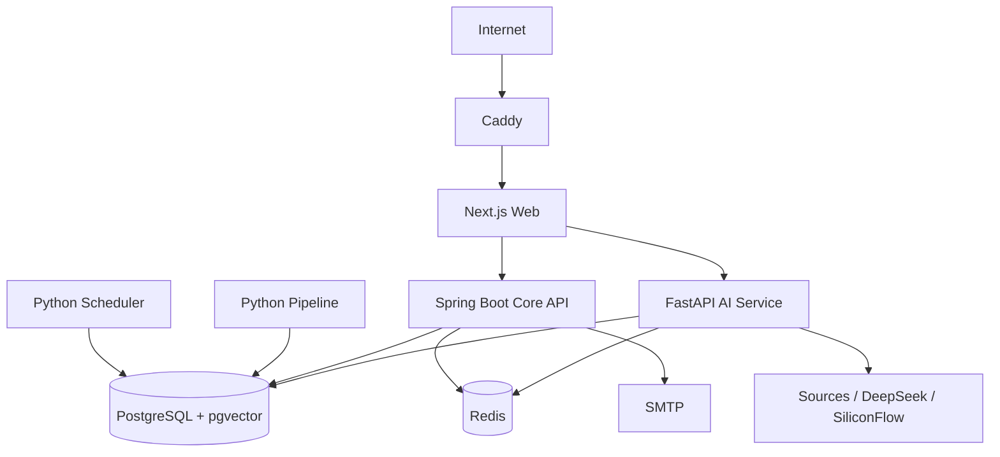

# 01｜业务与系统架构
## 业务问题

公开 AI 信息的难点不是缺少链接，而是来源多、更新快、同一事件被重复报道、时间语义混乱，
以及摘要无法快速核验。系统因此围绕三层问题设计：发生了什么、如何演变、意味着什么。

## 用户闭环



匿名读者不需要账号就能阅读与问答；订阅只保存最小邮箱事实。工程页面把质量门、运行状态、
模型版本和信源健康暴露出来，避免“看起来会答”却无法解释。

## 业务模块

| 模块 | 输入 | 核心规则 | 输出 |
|---|---|---|---|
| 信源与采集 | 公开 Feed/API/列表/仓库 | cadence、租约、回源全文、政策边界 | 版本化内容 |
| 内容智能 | 正文与元数据 | schema 校验、实体、主题、去重、评分 | 可发布 item/chunk |
| 事件智能 | 多篇相关内容 | 时间、实体、动作与语义聚类 | Story 与主来源 |
| 编辑交付 | 已发布 Story | 证据、类别、多样性、周期门 | 精选与三周期报告 |
| RAG | 问题与证据库 | 多路召回、重排、选证、绑定、拒答 | 可追溯回答 |
| 订阅投递 | ACTIVE 订阅 + PUBLISHED 报告 | 时区、幂等、重试、退订 | 邮件投递事实 |
| 工程治理 | 运行与评测 artifacts | 静态/动态分层、RBAC、审计 | 质量和运维页面 |

## 系统拓扑



### 服务边界为什么这样划

- Web 保持内容优先 SSR、交互和同源代理，不直接查库或持有高权限凭据。
- Core API 承担稳定、事务性强的内容读、订阅、报告、管理权限和审计。
- AI Service 承担变化快且依赖 Python 生态的采集、抽取、NLP、向量、重排和生成。
- PostgreSQL 保存所有业务事实；Redis 随时可以清空重建。

这种拆分不是为了“微服务数量”，而是把稳定业务边界与模型/采集生态的变化隔开。当前是
单机 Compose 下的跨语言模块化系统，不应把它描述成大规模微服务平台。Scheduler/Pipeline
通过 PostgreSQL 状态协作，不是 Outbox 消费者，详见 ADR-0028。

## 一条业务事实如何服务多个出口

```text
公开原文 → content revision → evidence chunk / entity / story
                              ├─ 精选与热点
                              ├─ 主题与事件页面
                              ├─ 日周月报告 → 邮件
                              └─ RAG 检索 → 引用原文
```

网站、报告、邮件和 RAG 都读取同一份 READY/PUBLISHED 事实，避免两个“摘要系统”逐渐漂移。

## 非功能目标

- 内容新鲜度和全文率可观测；单源故障不拖垮全局；
- 外部调用有超时、有限重试、主机限速、幂等和 trace；
- LLM 输出必须 schema 校验，RAG URL/引用必须服务器绑定；
- PUBLISHED 报告、ACTIVE 订阅和投递状态由数据库事务约束；
- 单机可部署、备份可验证、镜像可回滚、内部端口不暴露公网。

## 取舍与扩展边界

| 当前不引入 | 当前理由 | 重新评估触发条件 |
|---|---|---|
| Kafka/RabbitMQ | 没有高积压或独立消费者扩缩容证据 | 持续 backlog、延迟超 SLO、重放需求 |
| 独立向量库 | 8k 级分块且强依赖 SQL 时间/实体过滤 | 单库 Recall/延迟/容量无法满足 |
| Elasticsearch | PostgreSQL FTS + CJK 已满足当前搜索 | 复杂聚合、吞吐或检索质量有量化缺口 |
| Kubernetes | 单机 2C4G、服务副本少 | 多节点、自动扩缩、故障域与团队需求出现 |
| GraphRAG/RAPTOR | 当前问题主要是时效与事件，不是图社区/长文跨章 | 多跳或跨章节集持续失败且实验显著收益 |

面试时重点不是“这些技术不好”，而是说明当前没有证据证明它们能抵消复杂度成本。
