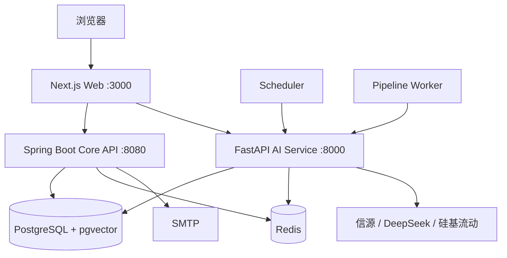
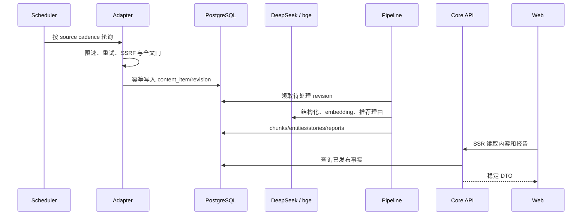

# 01｜业务与系统地图

## 1. 项目解决什么问题

公开 AI 信息分散在官方博客、研究站点、GitHub、RSS 与行业媒体中。用户真正需要的不是
“更多链接”，而是四件事：及时发现、可靠去重、按事件组织、能够回到原文核验。

因此产品形成两个闭环：

1. **情报闭环**：采集 → 正文 → 结构化 → 去重/聚类 → 精选/报告 → 网站与邮件。
2. **问答闭环**：问题 → 多路检索 → 重排/选证 → 受约束生成 → 引用校验 → 反馈与评测。

读者看到的是精选、热点、事件、主题、报告和问答；工程页面负责解释质量、运行状态、
模型与信源，不与内容导航混为一谈。

## 2. 服务边界

| 组件 | 负责 | 不负责 |
|---|---|---|
| Next.js | SSR、交互、同源代理、展示层缓存 | 业务真相、直接查数据库、持有 OPERATOR 凭据 |
| Core API | 内容读 API、报告发布、订阅、管理鉴权与审计 | 采集与 RAG 算法 |
| AI Service | 采集、加工、报告生成、RAG、评测与模型调用 | 浏览器会话、公开页面布局 |
| PostgreSQL | 业务事实、状态机、向量、检索轨迹、投递事实 | 临时限流桶 |
| Redis | 读缓存、限流、RAG 缓存、分布式短锁 | 任何不可丢的业务真相 |

这套边界的价值在于：模型供应商或 Redis 故障不会改变数据库中的发布事实；Web 被拿下时
也只有 VIEWER 管理凭据，不能修改信源与生成模型。

## 3. 主业务时序

每个外部请求都有超时、有限重试、主机限速和 trace id。调度失败只推进该信源的健康状态，
不会删除历史内容；Pipeline 获取数据库 advisory lock，避免两个副本重复加工。

## 4. 核心数据对象

| 对象 | 含义 | 关键关系 |
|---|---|---|
| `source` | 信源配置与运行状态 | 1:N `content_item` |
| `content_item` / `content_revision` | 稳定内容身份与正文版本 | revision 参与切块与处理 |
| `content_chunk` | RAG 最小检索单元 | 向量、全文索引、父块关系 |
| `entity` / `content_entity` | 公司、模型、人物等实体 | 主题页与实体时间检索 |
| `story` / `story_item` | 多篇内容聚成的事件 | 报告与事件聚合 |
| `report` | 日/周/月报告的发布快照 | 只有 `PUBLISHED` 可发送 |
| `rag_query` / retrieval trace | 问答结果与检索解释 | 支撑历史 URL 和质量排查 |
| `report_subscription` / delivery | 双确认订阅与投递事实 | 唯一约束保证幂等发送 |

## 5. 为什么技术栈这样选

- **PostgreSQL + pgvector**：当前数据规模可在一个事务库内同时做向量、全文、时间和实体过滤，
  避免向量库与业务库双写一致性。
- **Redis 而不是队列**：当前没有必须独立扩缩容的异步消费者；引入 MQ 会增加数据同步和运维面。
- **Spring Boot + FastAPI**：Java 承担稳定读接口、安全与投递；Python 承担模型、采集和评测生态。
- **Next.js SSR**：内容首屏和分享 URL 可直接返回 HTML，内部服务不暴露公网。
- **Docker Compose**：单机 2C4G 的服务数量与流量不值得引入 Kubernetes。

判断边界要主动说清：若分块量、并发或团队边界增长到单库无法满足，向量库、队列与编排平台
都可以重新评估；当前“不用”不是永远不用。
