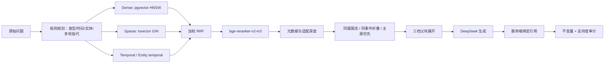

# 02｜数据管线与 RAG 深入

## 1. 从一个 URL 到可检索证据

1. `config/sources.yaml` 定义信源，`ingestion-profiles.yaml` 定义适配器契约。
2. Scheduler 只领取到期信源；全局与单主机并发有上限。
3. Adapter 读取 RSS/API/列表做**发现**，再回源正文。RSS 摘要绝不直接当全文。
4. 规范 URL、内容哈希与数据库唯一键共同保证幂等；正文变化产生 revision。
5. 全文门检查正文长度、正文/摘要比、占位页和登录墙；失败样本留可重放 fixture。
6. DeepSeek 把非结构化正文变成受 schema 校验的摘要、类型、实体与 claims。
7. 文档按标题和语义边界切块，bge-m3 生成 1024 维向量；失败时可重试、不中断已入库正文。
8. 近重复内容合并，Story 聚合同一事件；推荐评分决定精选，报告复用已加工事实。

信源状态不是手填看板。每次调度会写最近成功、失败阶梯和全文率；Core API 从 PostgreSQL
读取，`/admin/sources` 每次刷新页面取得最新快照。页面本身不做秒级轮询，避免把运维读流量
误当成实时监控。

## 2. RAG 在线链路

### 查询规划

解析“最近一周”等相对时间为绝对时间窗；识别 latest、timeline、comparison、fact、explanation、
unanswerable 六类问题；用受控别名和会话上一轮解析“它/那家公司”。通用 LLM 改写默认关闭，
因为黄金集未证明多一次外部往返有收益。

### 多路召回与融合

- Dense 找语义相近内容，擅长改写与自然语言。
- Sparse 保留型号、版本号、缩写等精确词。
- Temporal/entity-temporal 不是独立搜索引擎，而是在明确时间窗/实体时约束候选。
- RRF 用名次而不是直接混不同量纲的分数；融合之后必须经过 reranker。

旗舰例中正确证据 dense 第 14、sparse 第 1、融合第 3，说明混合检索解决的是真实召回缺口。
但 B8 的 42 组融合权重在接上 reranker 后只差 0.0004，所以没有为了离线中间指标改生产权重。

### 重排与选证

交叉编码器在 query-passage 对上打分，再考虑问题直达度、信源契合度、时间契合度。
选证阶段限制同一文档占位、折叠同一 Story、优先一手源，最后按问题类型选择父块展开深度。
检索轨迹把每个候选的通道名次、调整、最终名次和淘汰原因落库。

### 生成与引用安全

模型只能看到编号证据 `[E1]...[En]`。服务端解析正文并将编号绑定回真实 chunk，URL 来自数据库，
而不是模型输出。以下任一情况触发受控拒答：引用越界、零引用非拒答、空正文非拒答、编号无法绑定。
解析器允许“有守卫的 Markdown/claims 回退”，但回退仍走同一套绑定与不变量。

## 3. `/eval` 里三类内容分别是什么

| 区域 | 数据性质 | 何时变化 | 用途 |
|---|---|---|---|
| 顶部发布门禁 | **固定发布快照** | 重跑完整评测并运行 `build_eval_summary.py` | 判断当前算法/模型能否发布 |
| 10 轮检索走势 | **历史实验档案** | 新增实验轮次时 | 解释组件为什么保留或撤销 |
| GEN/GEN-FIX/LAT | **生成与延迟实验** | 主动重测时 | 防误拒、假前提与性能回归 |
| `/ops` | **运行数据** | 新请求与流水线持续写入 | 看真实模型、token、成本、P50/P95 |

所以 `/eval` 不会随着每次提问自动跳数字。这样才可复现：固定黄金集、固定语料截止时间、固定
embedding/reranker/generation model，再把 run id 和逐题 JSON 一起保存。换模型或检索策略后，
必须产生新的 run，而不是覆盖旧结果。

### 核心指标怎么解释

- `Recall@20`：相关证据是否进入前 20，测“找没找到”。
- `MRR`：第一条相关证据排得多靠前，测“有没有尽快找到”。
- `nDCG@10`：前 10 的多级相关性排序质量。
- 引用覆盖率：需要证据的句子是否都有引用。
- 引用精度/支持度：被引用段落是否真的支撑该陈述。
- 可答题误拒：明明有答案却拒绝；必须与不可答题拒答能力一起看。
- P50/P95：中位与尾延迟；这个项目的瓶颈主要是外部模型往返，不是本地 SQL。

## 4. 已验证与仍需观察

已验证的发布快照：主集 Recall@20 89.9%、句级引用覆盖 98.8%、段落支持度达标率 93.4%、
可答题误拒 0/78、诱导题错误断言 0/12。它们是特定快照的事实，不代表未来模型切换后仍自动成立。

仍需扩大：别名/错别字/同名实体噪声集、跨语言改写、自动 citation precision 的人工校准、
更长时间的真实用户反馈，以及每次生成模型切换后的回归评测。
