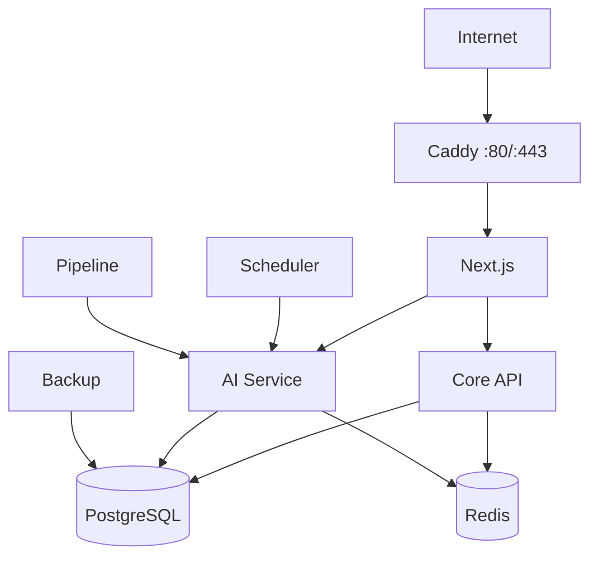

# 03｜生产、邮件、安全与迁移

## 1. 当前生产拓扑

生产使用单机 Docker Compose。Caddy 是唯一公网入口并自动管理 HTTPS；Web、Core API、
AI Service、Scheduler、Pipeline、PostgreSQL、Redis 和备份任务都在私网 Docker 网络内。
应用镜像使用 Git commit SHA，不在服务器上临时 build；部署前后都有 smoke 与回滚指针。

## 2. 报告邮件的完整业务流程

1. 用户在已发布报告页输入邮箱并选择日/周/月。
2. Core API 创建 `PENDING` 订阅请求；确认 token 是包含请求 ID、版本和过期时间的 HMAC 签名，
   数据库不保存可复用明文 token。
3. SMTP 发送确认链接；未确认地址不会建立正式的 `ACTIVE` 订阅。
4. 用户点同源 HTTPS 链接后状态变为 `ACTIVE`。
5. 调度器每 5 分钟扫描：已到收件人时区 08:30、报告状态为 `PUBLISHED`、本期尚未投递。
6. 邮件发送的是对应报告摘要、主要章节与回站链接，不重新临时生成一份不可追溯的内容。
7. `(subscription, report)` 唯一投递事实保证重复扫描不会重复发送；SMTP 失败有限重试。
8. 每封邮件带签名退订链接，退订立即生效。

邮件失败不会阻塞采集、加工、站内报告、AI 动态或精选。它是发布后的独立投递通道，
不是主流水线的事务前置条件。

## 3. 安全边界

- 管理端采用高熵 Bearer token、VIEWER/OPERATOR 两角色、写操作二次确认、幂等键与审计。
- Web 只持 VIEWER，管理写接口不透传给匿名浏览器。
- 采集端有 SSRF 校验、禁止私网地址、响应大小上限、超时、有限重试和 per-host 限流。
- API key、数据库密码、SMTP 应用密码只在生产 `.env`，不进 Git、镜像和日志。
- RAG 不信任模型 URL/引用/JSON；服务端重新绑定并校验。
- PostgreSQL/Redis/API 不暴露公网；SSH 应使用密钥并逐步关闭口令登录。

## 4. 为什么 2 核 4G 能运行，边界在哪里

模型推理在 DeepSeek/硅基流动外部完成，本机主要承担 HTTP、解析、数据库、容器和少量文本计算。
当前低并发个人作品集，2C4G 可以支撑，但需要：限制并发、为 JVM/Python/数据库设置内存边界、
保留 swap、监控磁盘和 Docker 日志。

风险通常先出现在内存和磁盘，而不是 CPU：PostgreSQL 数据与向量会增长，镜像层、备份和日志
也占空间。60GB 可作为当前阶段起点，但必须设置磁盘告警和异机备份；若 30 天利用率持续高于
70%，先扩盘，再考虑升级 4C8G。5Mbps/500GB 对文本网站够用，图片或大文件不应从该主机直出。

## 5. 从香港旧机迁到腾讯云大陆机

产品名 **AI Hot Radar** 和域名 `aihotradar.online` 都可以不变，迁移的是运行环境与 DNS 指向。

1. 购买 Ubuntu 22.04/24.04 的目标机并完成安全组、SSH 密钥、Docker 与时间同步。
2. 新机部署与 GitHub `main` 对应的同一个不可变镜像 SHA。
3. 从旧机做 PostgreSQL 一致性备份、校验和与必要配置备份；在新机隔离恢复。
4. 使用临时 hosts/子域名完成健康、首页、报告、RAG、邮件与备份恢复 smoke。
5. 大陆机在域名完成 ICP 备案前不要正式对公网提供该域名服务。
6. 备案完成后降低 DNS TTL，将 A 记录切到新 IP；旧机保留 48–72 小时用于回退。
7. 观察错误率、延迟、调度、磁盘和邮件后，再下线旧机并轮换所有密钥。

迁移不是“服务器上 git pull 然后重启”。推荐链路是：本地分支 → PR/CI → `main` → 构建 SHA 镜像
→ 新旧服务器部署同一 SHA → 数据恢复与 smoke → DNS 切换。这样代码版本、数据版本和回滚点都可追踪。
