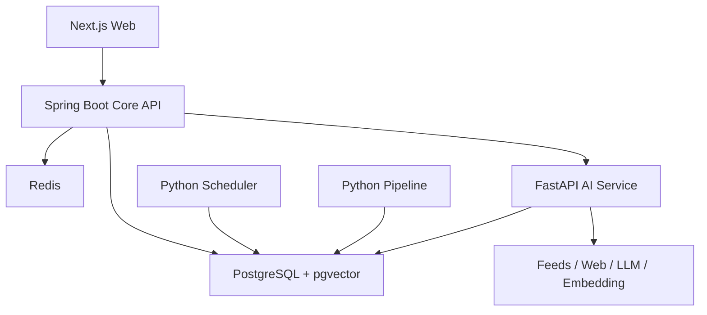

# 02｜系统架构与服务边界

文档 ID：`AHR-ARCH-200`

## 1. 逻辑架构



当前生产没有 Outbox Publisher/Consumer。Python Scheduler 以 `FOR UPDATE SKIP LOCKED`
领取到期信源，Python Pipeline 以 advisory lock、输入版本和幂等写推进处理。`outbox_event`
是同事务事件日志与未来传输预留点，不是当前任务总线，见 ADR-0028。只有持续积压、查询
干扰或消费者独立扩缩容等证据出现后，才评估 RabbitMQ。

## 2. 当前仓库结构

```text
ai-hot-radar/
├── apps/
│   ├── web/                 # Next.js
│   ├── core-api/            # Spring Boot
│   └── ai-service/          # FastAPI + workers
├── api/                     # OpenAPI 公共契约
├── schemas/                 # Java/Python 共享 JSON Schema
├── database/
│   └── migrations/          # Flyway SQL，唯一数据库迁移入口
├── config/
│   ├── sources.yaml
│   ├── ingestion-profiles.yaml
│   ├── social-watchlist.yaml
│   └── taxonomy.yaml
├── infra/
│   ├── compose/
│   ├── caddy/
│   └── scripts/
├── data/                    # fixture、黄金集与可复现评测输入
├── docs/                    # 规格、ADR、手册、面试与发布证据
├── scripts/                 # 文档校验、评测汇总和工作区清理
├── AGENTS.md                # 唯一、工具无关的工程规则入口
└── DEVELOPMENT.md           # 本地开发与验证入口
```

不跟踪 Claude/Cursor 等工具专用规则副本；任何工具都读取 `AGENTS.md`。`database/migrations/`
不是生成垃圾，而是数据库从空库到当前结构的可执行历史，生产部署和隔离恢复都必须按序运行。

## 3. 模块职责

| 模块 | 必须负责 | 禁止负责 |
|---|---|---|
| `web` | SSR 页面、交互、展示、流式 RAG UI | 直接访问数据库、保管模型密钥 |
| `core-api` | 内容查询、Story、报告发布、订阅/邮件、权限、审计、管理状态 | 采集调度、网页正文解析、Embedding 计算 |
| `ai-service` | 采集适配、正文抽取、AI 结构化、聚类、Embedding、Rerank、回答生成 | 用户权限、收藏和邮件业务事实 |
| PostgreSQL | 业务事实、索引元数据、向量、outbox | 临时缓存语义 |
| Redis | 热列表、读缓存、限流、短锁、SSE 临时状态 | 不可恢复任务或唯一业务记录 |

## 4. 端到端状态机

`raw_document.processing_status`：

```text
DISCOVERED -> FETCHED -> PARSED -> ENRICHED -> DEDUPED
           -> CLUSTERED -> INDEXED -> PUBLISHED
```

失败状态：`RETRYABLE_FAILED | DEAD_LETTER | BLOCKED_POLICY | DELETED`。

每个阶段必须：

- 比较当前状态和版本，支持安全重入；
- 保存 `attempt_count`、`last_error_code`、`next_retry_at`；
- 记录输入版本、处理器版本与输出摘要；
- 只在本地事务提交后推进状态和写 outbox。

## 5. 外部调用韧性

| 调用 | 连接/读取超时 | 最大尝试 | 退避 | 特殊规则 |
|---|---:|---:|---|---|
| RSS/Atom | 3s / 10s | 3 | 1s, 4s + jitter | 支持 ETag/Last-Modified |
| 普通 HTML | 5s / 20s | 3 | 2s, 8s + jitter | 按 host 限速 |
| 浏览器渲染 | 10s / 30s | 2 | 5s + jitter | 独立并发池，默认关闭 |
| LLM | 5s / 60s | 2 | 2s + jitter | 只重试超时/429/5xx |
| Embedding | 5s / 30s | 3 | 1s, 4s + jitter | 批处理，幂等写 |
| Email | 5s / 20s | 3 | 10s, 60s + jitter | `delivery_key` 防重发 |

熔断按 `provider + operation` 隔离；打开后使用已有摘要/旧索引降级，不阻塞内容查询。

## 6. 数据一致性

- 采集与处理以 PostgreSQL 状态、行锁/advisory lock、输入版本和唯一键实现安全重入；
- `outbox_event` 当前只记录同事务事件；`processed_event` 是预留表，不能当作已消费证据；
- AI 结果采用 compare-and-set：只有输入 hash 与任务创建时一致才能落库；
- 索引重建写新 `index_version`，验证后切换，不原地破坏有效索引；
- Story 人工锁定后，自动聚类只能提出建议，不能覆盖人工决策。

## 7. 缓存策略

| Key | TTL | 失效方式 |
|---|---:|---|
| `home:selected:{date}:{filters}` | 5 min | 发布/撤选后 tag 失效 |
| `hot:stories:{window}` | 2 min | 分数批次完成后失效 |
| `topic:{id}:summary` | 10 min | Story 关系变化后失效 |
| `item:{id}` | 30 min | 内容更新/下架后失效 |
| `rate:{principal}:{route}` | 滑动窗口 | 原子脚本 |

必须防止缓存击穿：互斥重建或 stale-while-revalidate；不得缓存管理端敏感响应。

## 8. 部署拓扑

当前单机：Caddy/HTTPS + web + core-api + ai-service + Python scheduler + Python pipeline +
PostgreSQL + Redis，并有备份/监控容器。只有 Caddy 暴露 80/443。浏览器渲染适配器当前
默认禁用，也没有独立生产容器；若按 allowlist 启用，必须设置独立资源限制。

扩展顺序：增加 Worker 副本 → RabbitMQ → PostgreSQL 读优化/连接池 → OpenSearch；不是直接迁移 Kubernetes。
