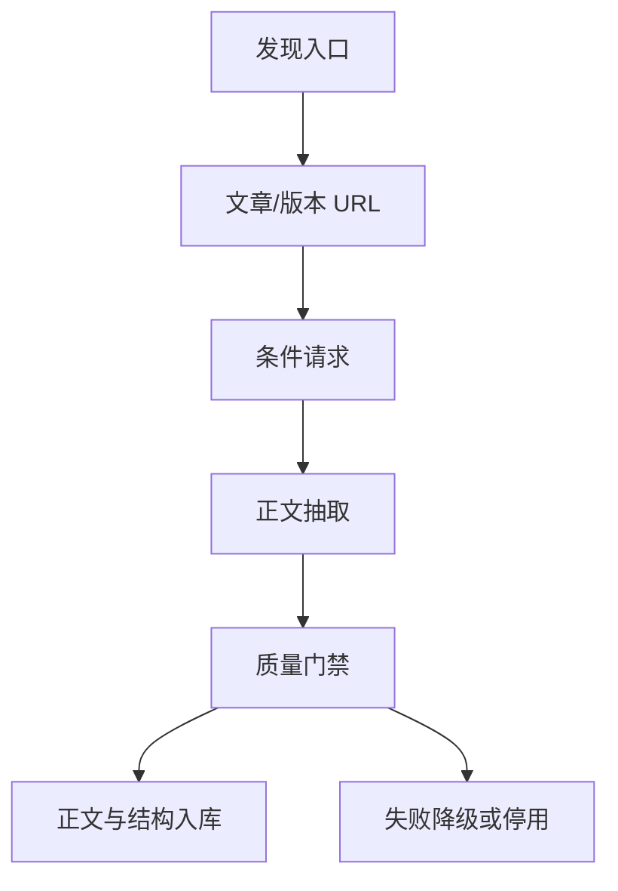

# 09｜信源注册表与全文采集规范

文档 ID：`AHR-SOURCE-900`  
版本：`1.1.0`
基线日期：`2026-08-17`

## 1. 结论与规模

AI Hot Radar 的信源池不是“媒体名称清单”，而是可执行的两层注册表：

| 注册表 | 数量 | 用途 |
|---|---:|---|
| `config/sources.yaml` | 140 | 官网、更新日志、RSS、GitHub、论文、作者和媒体的可采集入口 |
| `config/social-watchlist.yaml` | 38 | 30 个 X 账号与 8 个公众号，仅作为受限事件线索 |

`sources.yaml` 当前覆盖：

- 115 个一手来源、11 个专家作者/Newsletter、14 个二手媒体；
- 116 个国际来源、24 个中文来源；
- 72 个完整发布说明/模型卡来源、56 个可抽取文章正文来源、7 个开放论文全文来源、5 个仅元数据/摘要来源；
- 88 个标准协议/API入口、34 个已经确认公开页面的入口、18 个需要站点专用适配器的入口；
- 126 个允许进入启动探测队列，14 个在专用适配器或授权完成前默认关闭。

这里的 `enabled: true` 不等于跳过验证直接上线。所有来源仍必须通过运行时门禁后才能变为 `ACTIVE`。

## 2. “能够读取全文”的准确含义

必须区分四件事：

| 能力 | 含义 | 是否等于可以公开转载 |
|---|---|---|
| 发现新内容 | 能找到新文章、版本或论文 URL | 否 |
| 回源读取正文 | 采集器能从 canonical 页面读取正文 | 否 |
| 内部索引全文 | 在条款与 robots 允许时，用于检索、聚类、摘要和 RAG | 否 |
| 公开展示全文 | 在网站直接向用户呈现复制的全文 | 只有许可证或明确授权时才允许 |

产品默认策略是：

```text
内部：保存允许获取的正文、结构和内容指纹，用于搜索/RAG
公开：展示标题、来源、短节选、AI摘要和原文链接
引用：回答中的证据永远跳转 canonical 原文
删除：权利人请求、robots/条款变化或来源撤回时联动删除正文、向量和缓存
```

因此，“不是只拿摘要”通过回源抓取 canonical 文章正文实现；“不侵犯转载边界”通过公开渲染策略实现。二者不能混为一谈。

## 3. 采集链路

每条来源必须完成以下闭环：



发现入口可以是 RSS/Atom、官方更新日志、GitHub Releases API、仓库活动、arXiv RSS、公开 JSON API、HTML 列表或 Sitemap。发现页提供的摘要不是最终语料；只要 `requires_article_fetch=true`，适配器必须继续请求文章页。

## 4. 正文抽取顺序

### 4.1 普通文章

```text
HTTP + ETag/Last-Modified
→ canonical/JSON-LD/发布时间解析
→ Trafilatura
→ Readability
→ 站点 selector
→ 允许时 Playwright
→ 文本质量评分
```

正文合格条件：

- 至少 300 个有效字符，且正文/导航文本比例达到阈值；
- 标题、canonical URL、来源、发布时间至少四项中的三项可解析；
- 不能是登录提示、Cookie 页面、验证码、付费墙占位或错误页；
- 主体不能重复导航、相关推荐和评论区；
- 抽样段落与页面可见内容一致。

### 4.2 官方更新日志与 GitHub Release

更新日志、Release body、模型卡本身就是完整文档，不需要再“补全文”。GitHub 首选 REST API，并使用 ETag 和速率限制头；Atom 只作为降级入口。仓库只有 Tag 没有 Release 时，抓取 Tag、默认分支 README/CHANGELOG 的差异，但不能把普通 commit 全部当资讯。

### 4.3 论文

arXiv RSS 只负责发现。正文链路是：

```text
RSS metadata → arXiv abstract → HTML（有则优先）→ PDF → GROBID/PyMuPDF → 结构化章节
```

网站公开只展示论文元数据、摘要和链接；内部全文解析遵守 arXiv API 条款和请求速率。

### 4.4 动态中文站点

中文动态站点必须使用独立 fixture 与全文门禁，不能因为“页面能打开”就直接进入语料库。2026-08-17 的实现状态为：

- 智东西通过公开 Sitemap 发现文章 URL，再用普通 HTTP 回源 canonical 文章；
- 字节跳动 Seed 通过公开 Sitemap 发现研究与产品文章，再用普通 HTTP 回源正文；
- 雷峰网与量子位沿用已验证的公开发现/回源链路；
- 机器之心、InfoQ 中文、36氪和 ModelScope 等来源仍保持关闭，直到有稳定、合法、可回放的发现入口与正文 fixture。

只有在普通 HTTP 无法取得正文且 robots/条款允许时，才启用浏览器渲染。禁止使用登录 Cookie 回放、验证码绕过或未授权接口。智东西和 Seed 的启用不代表绕过其访问控制，也不触发全站历史回填：每轮只处理按 `<lastmod>` 排序后的有限最新窗口。

## 5. 来源状态机

配置状态与运行状态分离：

```text
CONFIGURED
→ PROBING
→ ACTIVE
→ DEGRADED
→ QUARANTINED
→ DISABLED
```

激活门禁 `AHR-SOURCE-GATE-01`：

1. 发现请求返回 2xx/304；
2. 至少发现 3 个不同 canonical URL，或更新日志能生成 2 个不同 revision；
3. 最新 3 篇中至少 2 篇正文解析通过；
4. 发布时间误差抽检不超过 24 小时；
5. fixture 重放结果稳定；
6. robots、条款、频率和公开展示策略已记录；
7. 无 SSRF、登录墙、验证码或付费墙绕过行为。

连续 3 次失败或正文成功率 24 小时低于 80% 时进入 `DEGRADED`；连续 24 小时失败进入 `QUARANTINED`，不允许悄悄用搜索摘要代替正文。

## 6. 来源优先级与最终证据

同一事件的证据优先级：

```text
官方发布/官方更新日志
> 官方 GitHub Release、模型卡、论文
> 官方工程博客和文档
> 权威媒体
> 技术作者/Newsletter
> 社区讨论
> X/公众号事件线索
```

X 或公众号帖子不能成为 Story 的唯一主来源。收到社交线索后，必须解析其外链或在绑定的 `canonical_fallback_source_ids` 中寻找正式页面。找不到正式页面时，只进入人工审核队列，不进入自动精选和 RAG 事实库。

## 7. “一口气做好”不等于同时高频抓取 140 个源

注册表一次覆盖完整，但上线节奏按可靠性分批：

| 批次 | 范围 | 目标 |
|---|---|---|
| Wave A | P0 官方更新日志、GitHub、arXiv、稳定 RSS，约 50–70 个 | 先形成高质量一手事实骨架 |
| Wave B | 作者、研究博客、国际技术媒体，约 25–35 个 | 增加分析、教程和独立核验 |
| Wave C | 中文动态媒体与厂商社区，约 15–25 个 | 逐站 fixture、selector 和浏览器降级 |
| Wave D | X、公众号、付费数据库 | 只在授权接口和合规方案到位后启用 |

这里的分批是部署顺序，不是继续遗漏信源。140 个可采集入口和 38 个受限监控目标已经在配置中完整登记。

## 8. 验收报表

管理后台必须提供以下字段：

| 字段 | 说明 |
|---|---|
| discovery_success_rate | 列表/API/RSS发现成功率 |
| article_fetch_success_rate | 文章页请求成功率 |
| fulltext_parse_success_rate | 合格正文比例 |
| median_body_chars | 正文长度中位数 |
| freshness_lag_p95 | 发布到入库的 p95 延迟 |
| duplicate_rate | URL/正文重复率 |
| canonical_resolution_rate | 社交/转载回到正式来源的比例 |
| last_success_at / last_error | 最近成功与错误 |
| robots_checked_at | 最近 robots 检查时间 |
| content_policy | 内部索引和公开展示边界 |

每周生成 `source-health.json` 与 `source-health.md`。任何来源若只有标题/摘要、没有正文，报表必须明确显示 `metadata_only`，不能计入全文成功率。

## 9. AI IDE 实施要求

采集开发必须读取：

1. `config/sources.yaml`；
2. `config/social-watchlist.yaml`；
3. 本文档；
4. `03-data-ingestion.md`；
5. `07-quality-security-ops.md`。

禁止一次写 140 个硬编码爬虫类。先实现通用 profile adapter，再为 `adapter_required` 来源添加声明式 selector 与 fixture。每个站点适配器必须有：成功页、无正文页、结构变化页、429/403、发布时间缺失和 canonical 冲突测试。
